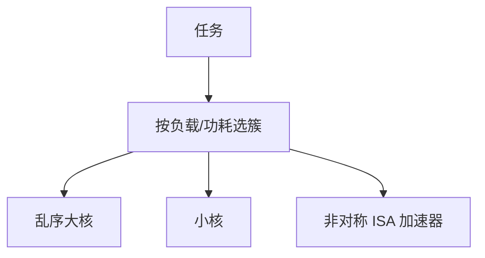

# 异构 SoC 与 big.LITTLE

同一 ISA 上做一颗宽乱序大核与一颗窄顺序小核：峰值走大核，后台与能效走小核；调度器要在迁移代价与功耗之间选。

<footer>—— 据 Kumar et al., Single-ISA Heterogeneous Multi-Core Architectures；ARM big.LITTLE 公开叙述 整理</footer>

[上一课](/cs/pim-near-memory) 把一种异构（近存）放到内存侧。手机与服务器 SoC 上更常见的是 **同一 ISA、不同微结构** 的 CPU 簇，外加 GPU/DSA。本课不重讲 PIM 命令。缺口是 **big.LITTLE：异构多核的性能–功耗前沿，以及任务往哪颗核上放。**

## 问题

全用 [深流水乱序](/cs/deep-pipeline-clock) 核：闲时漏电与面积吃不消。全用小核：单线程串行段（Amdahl）崩。缺口不是 Flynn 的 MIMD 定义，而是**单 ISA 异构：迁移只需拷贝架构状态，不必重编译，但 [TLB](/cs/tlb-hierarchy-pwc)、cache、预取器都是冷的。**

Kumar 等展示单 ISA 异构的能效。ARM big.LITTLE / DynamIQ：共享缓存或按簇，OS 用容量与频率点做调度。这不是 GPU SIMT，也不是 big.LITTLE 当广告词乱用。

## 方法

大核：宽发射、深窗口、激进预取。小核：短管线、窄发射、简单预测。迁移：保存 ISA 状态，在目标核上恢复；可选共享 L3 减少冷缺失。加速器：不同 ISA，走驱动队列，见 [DSA](/cs/dsa-accelerator)。

## 机制

调度错误：把长串行放小核，或把常驻后台放大核空转。迁移过频则 [MLP](/cs/mlp-memory-parallelism) 与 BTB 全冷，比留在稍慢的核更差。一致性：大小核仍走 [MOESI/目录](/cs/moesi-mesif)，频率不同使响应时间不对称。

共享 L3 让迁移后数据还在，但预取器、uop cache、[循环流缓冲](/cs/loop-stream-buffer) 仍冷。短任务迁移不划算：上下文切换那一截可能长过任务本身。

## 边界

本课不写具体 cpufreq governor。片上如何把这些核连起来是下一课 NoC。拓扑再下一课。

后课默认：异构是调度问题加迁移税。核间通信走片上网络，而不是假定广播总线。

## 小结

- 单 ISA 异构用大小核切性能/瓦；迁移有微结构冷启动税。
- 加速器是另一 ISA，靠队列。
- 片上互连形状是下一课 NoC。
- 出处：Kumar et al.；ARM big.LITTLE；Hennessy and Patterson, *CA:AQA*。
