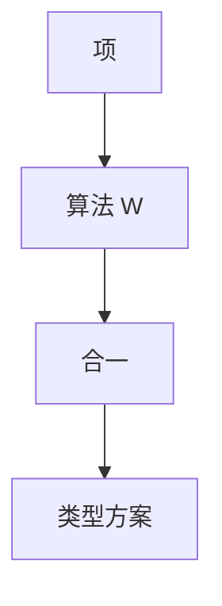

# Hindley–Milner 算法 W

在 let 多态的核心语言上，算法 W 用合一求出主类型方案；失败则没有简单类型实例。

<footer>—— 据 Hindley, 1969；Milner, 1978；Damas and Milner, Principal Type-Schemes for Functional Programs, 1982；Pierce TAPL 整理</footer>

上一课[简单类型 λ](/cs/simply-typed-lambda)要人写满 $\tau\to\tau'$。主干[类型推导直觉](/cs/type-inference)已给合一的形状。缺口是**算法 W**：对 Mini-ML 项具体怎么推广、怎么实例化、occurs check 卡在哪。本课钉伪代码级步骤，不把 System F 的类型 lambda 写进主干。

## 问题

STLC 的恒等须写成 $\lambda x:\tau.x$。ML：`id` 的类型是 $\forall \alpha.\,\alpha\to\alpha$，在 `id 1` 与 `id true` 各实例化一次。W：给项与环境，返回替换与类型（或方案）。应用处合一；`let x = e1 in e2` 先推 $e_1$，再把不被环境提到的变量量化。缺口是**推广时机**，不是再定义箭头。

与主干直觉课的差：本课把 let 绑定的 $\mathrm{Gen}$ 写清楚，并点名下一课的值限制——W 在可变引用上会推得过宽。

### 主类型不是「任意超类型」

principal type scheme 是最一般的可量化结果。子类型后课才有宽化；HM 合一是对称的，没有「int 是 object」。

Damas–Milner 1982。算法 W 与 J、M 是同一理论的不同陈述。Pierce TAPL 第 22 章。本课不证完备性全文。

## 方法

$\mathrm{W}(\Gamma,e)$：变量则实例化方案；$\lambda$ 则新鲜 $\alpha$，推体；应用则推两端，合一左件与 $\alpha\to\beta$；let 则 $\mathrm{Gen}$。合一：变量绑到项（先 occurs），箭头结构递归。

实现：替换用并查集路径压缩（Appel / 现代编译器常见）。错误信息：合一失败时保留两侧类型，指向应用结点——接前端诊断，不在此展开。

## 机制

复杂度：合一近线性摊还；最坏病理项可指数（类型大小）。实用 ML 够用。没有 let 只有 λ 的核心是 STLC 推导，主类型仍存在但不量化。

不要把 W 当重载决议：`+` 的多实现是类型类或特设重载，后课。

## 边界

本课不写值限制的全部反例，下一课专门收。不引入高阶多态（System F 的推断不可判定，点名）。后课默认：HM = let 泛化 + 合一主类型。下一课 let 多态与值限制。

也不把 Haskell 的扩展（GADT、TypeFamilies）当 W 的一部分。

## 小结

- W：合一 + let 处 $\mathrm{Gen}$，得主类型方案。
- 应用处实例化；λ 参数用新鲜变量。
- occurs check 拒绝无限类型。
- 出处：Hindley；Milner, 1978；Damas and Milner, 1982；Pierce TAPL。
