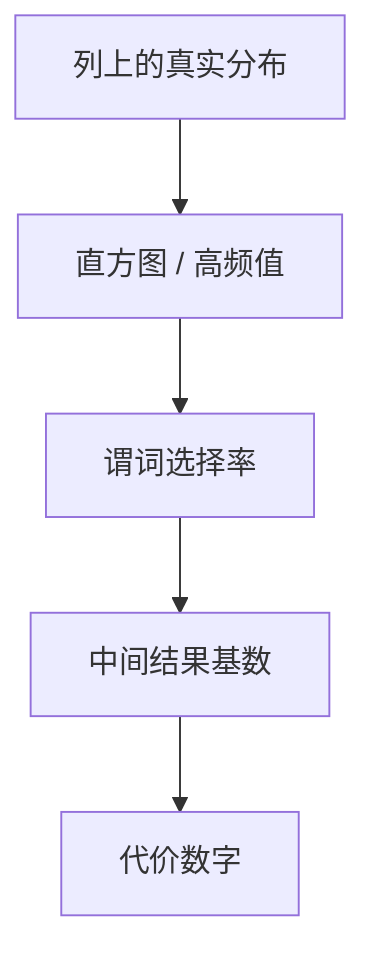

# 直方图与基数

选择率不能靠「均匀且独立」蒙对；直方图把列上的值分布收成可查的桶，基数估计才有输入。

<footer>—— 据 Selinger et al., 1979；Ioannidis 对直方图；Ramakrishnan and Gehrke</footer>

[上一课](/cs/cost-estimate)给出页 I/O 与 CPU 的代价模型。本课不重写公式结构。缺口是模型里的数字：谓词选择率、连接结果有多大。目录若只存 `COUNT(*)` 与 min/max，倾斜数据会让嵌套循环看起来便宜。直方图与频次计数是统计合同。

## 问题

代价估计留下「用目录里的基数」。均匀假设：`col = c` 的选择率 = 1/NDV。现实是长尾。等宽/等高直方图、最频繁值列表，把分布收成粗图。多列相关破坏独立假设，联合选择率估爆——本课承认缺口，不把多维直方图当必装。

过期统计比错误公式更常见：插入大量新键后仍用旧 NDV。ANALYZE 一类命令是维护，不是优化器搜索。

## 方法

对单列：维护 NDV、NULL 比例、直方图桶。等值查频次或桶平均；范围用桶宽度积分。连接基数：用 NDV 公式当独立时的起点。估计进入[查询计划](/cs/query-plan) 每个节点。本课不把采样估 NDV 的全部算法写完。

## 机制

基数是计划搜索的燃料：估小了会选 NLJ 打大表，估大了会多余排序。它不改变 SQL 语义，只改变物理树。改写课会先变形再估；统计错则漂亮的树仍慢。

## 边界

本课不引入学习优化器当主干。逻辑树如何先变瘦，下一课查询改写。

后课默认：选择率来自统计，不是均匀口号。先改逻辑树再估。

## 小结

- 直方图把分布收成桶，供基数估计。
- 独立与均匀是默认谎言，倾斜时失败。
- 逻辑改写下一课。
- 出处：Selinger 1979；Ioannidis；Ramakrishnan and Gehrke。
