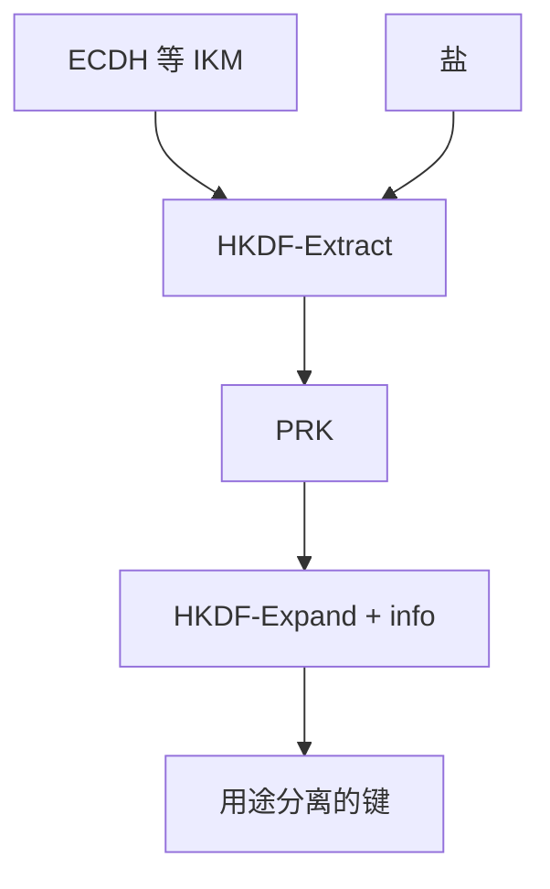
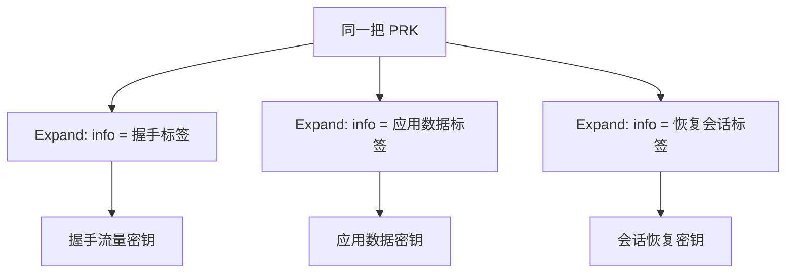

# HKDF

HKDF 先用 HMAC 提取，把不匀的输入密钥材料收成伪随机密钥，再扩展出多条用途分离的输出。它不是慢哈希，也不从弱口令里变出熵。

<footer>—— Krawczyk, Cryptographic Extraction and Key Derivation, 2010；RFC 5869</footer>

上一课[CSPRNG](/cs/csprng)从熵池抽新鲜随机。缺口是**已经有共享秘密**（ECDH 输出、PSK）时如何派生 AEAD 键、IV 盐、下一跳棘轮键。主干[KDF 与慢哈希](/cs/kdf-slow-hash)管口令；本课 HKDF 管高熵 IKM。

后课默认已经读完本课钉下的合同，只补差，不从该领域第一性原理重开。

## 问题

ECDH 的共享坐标不是均匀密钥。直接截断当 AES 键会留结构。HKDF-Extract(salt, IKM)→PRK，HKDF-Expand(PRK, info, L)→OKM。`info` 做域分离：同一 IKM 不能在两条协议里撞键。缺口是提取–扩展，不是再讲 bcrypt。

### 不能当口令哈希

口令熵低，要慢哈希与盐。HKDF 快，假设 IKM 已有足够熵。

RFC 5869。TLS 1.3 的 HKDF-Expand-Label 是加了标签的扩展。Signal 棘轮更后用同一思想。

直觉类比：Extract 像把成色不匀的金料（ECDH 输出带结构）统一熔成一根标准金条（PRK）；Expand 再当模具，从金条上压出一枚枚不同用途的硬币——info 标签就是币面上的「面值」，不同面值互不通用。

## 方法

画 Extract 与 Expand。强调 salt 与 info 的角色。对照：ChaCha/AES 的密钥从 OKM 切开，nonce 另计。指出长度扩展已由 HMAC 关。

```mermaid
flowchart TD
  IKM["ECDH 等 IKM"] --> EX["HKDF-Extract"]
  SALT["盐"] --> EX
  EX --> PRK["PRK"]
  PRK --> EXP["HKDF-Expand + info"]
  EXP --> OKM["用途分离的键"]
```

## 机制

域分离让「同一共享秘密」长出握手密钥、应用密钥、导出密钥而不串用。这是协议级构造的零件。密钥如何存放、谁能碰，下一课 HSM 与生命周期——算法再对，内存里的明文键仍是威胁模型里的端点。

```mermaid
flowchart TD
  PRK["同一把 PRK"] --> E1["Expand: info = 握手标签"]
  PRK --> E2["Expand: info = 应用数据标签"]
  PRK --> E3["Expand: info = 恢复会话标签"]
  E1 --> K1["握手流量密钥"]
  E2 --> K2["应用数据密钥"]
  E3 --> K3["会话恢复密钥"]
```

数字实例：以 SHA-256 为例，Extract 输出 32 字节 PRK。若应用要一把 AES-256 键（32 字节）加 12 字节 IV，Expand 第一轮 T1 = HMAC(PRK, info‖0x01) 取 32 字节当键；不够再算 T2 = HMAC(PRK, T1‖info‖0x02) 拼接后切出 12 字节 IV。

## 边界

本课不把 Argon2 重写一遍。原语课序到 HKDF 收口；下一课序协议级构造从密钥管理与 HSM 起，问「键在哪」。

常见误区：把 HKDF 当「口令加密」工具。它假设输入已有高熵——人选的口令往往只有几十比特熵，字典撞库跑得飞快；口令场景要交给 Argon2 一类带盐慢哈希，HKDF 只伺候 ECDH 输出、PSK 这种材料。

## 小结

- CSPRNG 产熵；HKDF 从已有 IKM 提取并扩展。
- info 做域分离；不能当慢口令哈希。
- TLS 1.3 与棘轮都吃 HKDF。
- 下一课序：密钥管理与 HSM。
- 出处：Krawczyk, 2010；RFC 5869；对照 RFC 8446。
