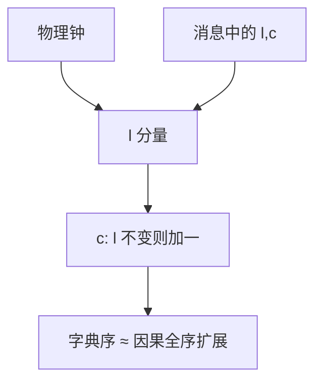

# 混合逻辑时钟 HLC

HLC 把 NTP 可读的物理时间与 Lamport 计数焊在一处：既大致可按墙钟排序，又在误差里保住 happened-before。

<footer>—— 据 Kulkarni, Demirbas, Madappa, Avva and Leone, Logical Physical Clocks, OPODIS 2014 整理</footer>

上一课[向量时钟](/cs/vector-clocks)给了完备因果，但 $O(n)$ 太大，且时间戳不能当「几点几分」给运维看。缺口是**单整数（或短元组）上的因果，同时贴近物理时间**。本课不重证 $V(a)\lt V(b)\Leftrightarrow a\to b$。后课快照仍用 Chandy–Lamport 的标记，不把 HLC 当全局割。

## 问题

Lamport 标量钟的数字会与墙钟脱节：长时间只本地事件，逻辑时间猛涨，或反过来墙钟超前很多。运维、调试、粗粒度 TTL 想读物理时间；协议想要 $a\to b\Rightarrow T(a)\lt T(b)$。缺口不是再做一个 NTP，而是 **pt + 逻辑计数**：在时钟误差范围内跟着墙走，误差撑不住时用计数把因果顶住。

Kulkarni 等人的 HLC：每个事件一个 $(l,c)$。$l$ 跟踪 $\max(\text{本地物理}, \text{收到的 }l)$；$c$ 在 $l$ 不变时当 Lamport 计数。比较先看 $l$ 再看 $c$。这样 $a\to b\Rightarrow (l,c)_a\lt (l,c)_b$，并且 $l$ 通常靠近 NTP。

HLC 不是 TrueTime：它不暴露 $\varepsilon$，也不提供外部一致性。它只是更好打印、更好做粗排序的逻辑钟。

## 方法

发送、接收、本地事件都更新 $(l,c)$：新 $l$ 取本地物理与消息 $l$ 的最大；若 $l$ 前进则 $c$ 清零，否则 $c$ 加一。溢出时必须把 $l$ 往前推或拒绝——实现要定策略。存储时往往打包成 64 位：高位物理毫秒，低位计数。

与向量钟：HLC 仍只是全序扩展，**不能**判定并发。要并发检测继续用版本向量。HLC 解决的是「一个时间戳既可读又尊重因果」。

## 机制

若物理钟回拨，HLC 的 $l$ 不减（取 max），表现为逻辑领先物理，直到墙钟追上。这比直接写墙钟安全：不会让因果后继的时间戳变小。对时超前后，$l$ 跟着走，$c$ 经常为零，日志看起来像普通毫秒时间戳。

CockroachDB 一类系统用 HLC 给事务时间戳，再在误差窗口上做不确定性处理——细节是数据库课与后课地理复制的交界，本课只准备时间戳形状。不要把 HLC 写成 Spanner TrueTime 的平替：没有 API 级 $\varepsilon$，就不能 commit wait。

本课不把混合钟推广成「可以替代向量」：维数压缩与因果完备是两回事。

## 边界

本课不写 Hybrid Vector Clock 全文，不证相对 NTP 的误差公式。不引入区块链出块时间。后课默认：需要打印与粗排序用 HLC；需要检测并发写用向量；需要全局一致割用快照算法，不是比较 HLC。

物理钟误差仍在：$l$ 贴近墙钟不等于跨机 $|Δl|$ 大于 $2\varepsilon$。因果保证来自计数规则，来自 NTP。

## 小结

- HLC 是带物理跟踪的 Lamport 钟，不是向量钟。
- $a\to b$ 蕴含时间戳增大；并发仍不可判定。
- 回拨时 $l$ 不减，靠 $c$ 顶住因果。
- 出处：Kulkarni et al., OPODIS 2014。
