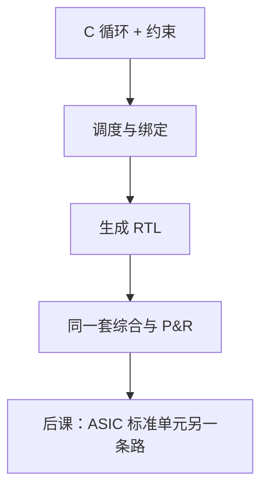

# 高层次综合 HLS

  
从 C/C++ 的循环生成流水线 RTL：调度决定哪一拍做乘，绑定决定用几份 DSP；程序员写的仍是算法，工具补时序状态机。

  <footer>—— 据 Coussy and Morawiec, High-Level Synthesis；Gajski et al., High-Level Synthesis 整理</footer>

[上一课](/cs/fpga-place-route)把手工 RTL 送到 P&R。算术单元里的[华莱士](/cs/wallace-carry-save)与[定点 MAC](/cs/fixed-point-dsp) 用 C 写往往更短。缺口是 **HLS**：把高级语言调度成 RTL，再走同一套综合与布局，而不是在 FPGA 上跑 CPU 解释 C。

## 问题

RTL 要显写流水线级与握手。[Verilog 基本](/cs/verilog-basics)已警告不要把 HDL 当软件。HLS 反向：接受「软件式」循环，用约束（目标周期、II、数组到 RAM/LUT 的绑定）推出状态机与数据通路。缺口不是新的乘法器电路，而是**调度与绑定**这两步。

II（initiation interval）=1 意味着每拍启动下一次循环迭代，需要足够的 DSP 与内存端口。这与组成课流水线是同一思想，工具自动插寄存器。

### HLS 不是「保证比手写 RTL 更快」

质量取决于可综合子集、依赖分析、是否把数组分区。随意指针与系统调用无法变电路。把 HLS 当成在 PL 里跑 Linux 用户程序，会与软核 CPU 方案混层。

Gajski 等人定义 HLS 的调度/绑定/分配。现代工具（Vitis HLS 等）实现不同，本课钉共同步骤。本栏不把 HLS 写成大模型算子生成器。

## 方法

输入：C 函数 + 接口 pragma（AXI 流、寄存器）。分析循环携带依赖。调度：在周期约束下安排运算。绑定：运算映射到 FPGA DSP 或 ASIC 乘法器。输出：RTL，然后[综合](/cs/synthesis-netlist)与 P&R。验证：C 仿真 vs RTL 协同仿真——后课测试平台家族。

定点类型在 HLS 里常显式标注位宽，对应定点 DSP 课的 Q 格式，而不是偷偷用 `float` 然后抱怨资源。

## 机制

后课 ASIC 流程也可以 HLS 到标准单元，只是库不同。手写 RTL 仍适合控制密集与极限时序（异步 FIFO 指针）。HLS 适合规则循环的算术阵列。验证负担不消失：生成 RTL 仍要 STA 与功能测试。

## 边界

本课不教某 pragma 清单，不把 PyTorch 图到 FPGA 的工具链写进主干（那会滑向大模型栏）。不声称 HLS 取代 CDC 设计：跨时钟仍要 FIFO 或工具认的同步器原语。

后课默认：HLS 产出仍是 RTL，走同一时序闭合；调度/绑定是新增的自动层。

## 小结

- C 循环经调度与绑定变成流水线 RTL。
- 仍要综合、STA、P&R；不是在 LUT 上解释 C。
- 不规则控制与 CDC 仍宜手写。
- 出处：Coussy and Morawiec；Gajski et al., *High-Level Synthesis*。
