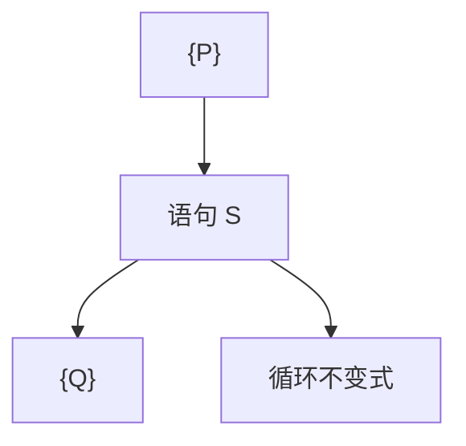

# Hoare 逻辑

三元组 $\{P\}S\{Q\}$：若前置 $P$ 成立则 $S$ 终止后 $Q$ 成立。赋值、顺序、条件、循环用公理与不变式，把程序正确性写成证明。

<footer>—— 据 Hoare, An Axiomatic Basis for Computer Programming, 1969；Winskel 整理</footer>

上一课[自然演绎](/cs/natural-deduction) 证的是逻辑公式。缺口是**程序**：状态上的断言。[操作系统](/cs/to-systems-boundary) 主干已封口，本课不重做语义实现，只把 Floyd–Hoare 规则钉在补层。部分正确 vs 完全正确（终止）要分开。

## 问题

状态把变量映到值。$P,Q$ 是一阶断言（可含量词）。赋值公理：$\{Q[e/x]\}x:=e\{Q\}$。顺序：把中断言接上。if：两分支后条件相同。while：不变式 $I$，体保持 $I$，退出加 $\neg b$。部分正确：不谈循环是否停。完全正确加变式（良基下降）。

可靠：可证三元组在操作语义下为真。相对完备（Cook）：若断言语言够表达最弱前置，则真三元组可证。下一课 WP。

### 不是测试

测试给有限输入。Hoare 要不变式覆盖无穷状态。找不到不变式不是逻辑失败，是证明义务未完成。

Hoare 1969；Floyd 1967 流程图断言。Winskel 有结构化规则。本课 while 语言足够；堆与分离逻辑点名不写。

## 方法

对一小段求绝对值或阶乘，写不变式与变式。强调：赋值公理「倒着代」是最常见错向。并发、别名使简单 Hoare 破——本课顺序无别名。

## 机制

编译器不自动给出 $I$。模型检验对有限状态可免写 $I$，后课。本课把「正确」从测试换成证明规则，与 SAT 求解的关系是：验证条件（VC）可变成公式交给求解器。

终止：完全正确需要额外证明；部分正确允许死循环。

并发：Owicki–Gries 要干涉自由；分离逻辑用 $*$ 谈堆不相交，本课顺序无别名。相对完备依赖断言语言能写 $\mathrm{wp}$：一阶算术够用整数程序，不够用任意可计算断言。测试给出反例三元组；证明给出全称。完全正确把终止当证明义务，不是运行到停。

## 边界

本课不写分离逻辑，不引入依赖类型程序。不证相对完备。后课默认：$\{P\}S\{Q\}$ 部分正确用不变式。下一课把 $P$ 算出来：最弱前置。

部分正确允许不终止；完全正确另证变式。赋值公理倒着代是方向。不变式要人给，模型检验在有限状态上可免写。别名与堆超出本课简单语言。

上一课留下的缺口在本课收口；「Hoare 逻辑」进入后课词汇表后只引用。文献用来钉对象与边界，不把本课写成该主题的独立综述。

## 小结

- Hoare 三元组：前置、程序、后置；赋值倒着代。
- while 靠不变式；终止靠变式，另证。
- 可靠相对操作语义；完备要断言够表达。
- 出处：Hoare, 1969；Floyd, 1967。
