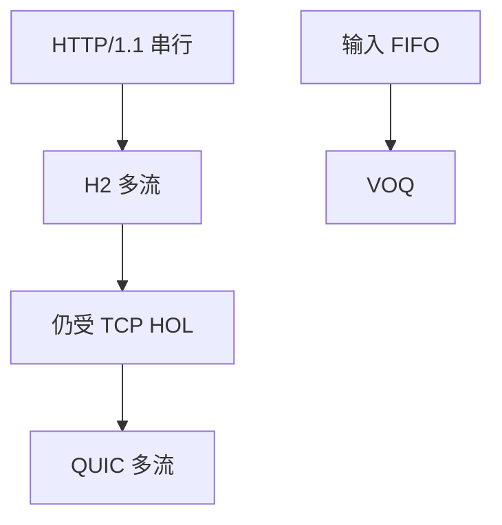

# 队头阻塞对照

同名「队头」出现在交换结构、HTTP/1.1 串行响应、以及 TCP 字节流上的 HTTP/2；解法一层一层不同。

<footer>—— 据 RFC 9112 / 9113；Karol HOL；RFC 9000 对照整理</footer>

[HTTP/1.1 持久](/cs/http11-persistent-chunked) 把请求排成队。[HTTP/2 多路](/cs/http2) 已给应用层解。[交换机 HOL](/cs/output-queue-hol) 是结构。[上一课](/cs/http11-persistent-chunked) 留下管道化失败。缺口是**对照三层 HOL**，避免混名。本课不把 HTTP/3 写完。

## 问题

1.1：连接上前一响应未完，后一请求的响应不能开始——应用 HOL。开多连接是笨解，伤 cc。HTTP/2：多流交错，应用 HOL 解了，但 TCP 丢一个段挡住所有流——运输 HOL。QUIC 再解运输。交换机 VOQ 解的是第三种：入端口 FIFO。PFC 暂停是第四种「整口冻」。

不要用一种队列算法「统一解决」。

教学对照。Kurose 分章讲，这里收口进阶课的词汇。

### 写 HOL 必须加层

1.1 应用串行；H2 解之但仍受 TCP；H3 再解运输。交换 VOQ 是第三对象。混名无法排障。

## 方法

三列对照：层、现象、对策。画三条路径。与 SCTP/QUIC 流对照。

方法止于选定对象与对照；机制才说它如何嵌入已有分层与主干课。

## 机制

TSO 合并不造 1.1 HOL，只改段大小。WFQ 不修 TCP HOL。数据中心 incast 是出口队列，不是 HTTP HOL，但浏览器多连接会加重 incast。CDN 用多连接与 H2 混合。

命名纪律：写「HOL」必须加层。

## 边界

本课不引入 HTTP/2 优先级树的全部。HTTP/3 是下一课。后课默认：H2 解应用 HOL，H3 解运输 HOL。

把所有卡顿都叫 HOL 会无法排障。

上一课留下的缺口在本课收口；「队头阻塞对照」进入后课词汇表后只引用。文献用来钉对象与边界，不把本课写成该主题的独立综述。下一课[HTTP/3](/cs/http3)。

## 小结

- 1.1 应用 HOL；H2 解之、TCP 仍堵。
- QUIC 解运输 HOL。
- 交换 HOL 是第三对象。
- 后课只引用本课钉死的对象，不从该领域总问题重开。
- 出处：RFC 9112/9113/9000；Karol et al.。
