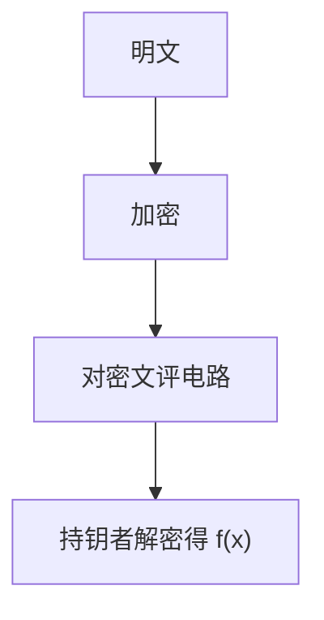

# 同态加密直觉

同态让未打开的密文还能加或乘，解密后等于对明文做了同样的运算。半同态已能做选举与简单统计；全同态能评任意电路，代价是噪声与参数。

<footer>—— Rivest, Adleman and Dertouzos 的设想；Paillier；Gentry, Fully Homomorphic Encryption Using Ideal Lattices, STOC 2009</footer>

## 定位

上一课[MPC](/cs/threshold-mpc)靠交互。缺口是**非交互外包**：数据在服务器上以密文计算，服务器不该见明文。本课直觉，不把 FHE 写成已可替换数据库的产品课。

后课默认已经读完本课钉下的合同，只补差，不从该领域第一性原理重开。

## 问题

AEAD 密文不能加。RSA 的乘性是缺陷也是半同态；Paillier 加同态更常用。Gentry：自举刷新噪声，使任意深度电路成为可能。缺口是噪声、电路深度与「谁持私钥仍见结果」——服务器无私钥则只见密文。

### 结果给谁看

同态不解决访问控制：能解密的人看见 $f(x)$。要隐藏 $f(x)$ 仍需 MPC 或只把结果给客户。

Gentry 2009。后续 BGV/BFV/CKKS 是工程族，本课不选厂商。不要发明 arXiv 号。CKKS 近似算术有精度合同，不是精确整数。

## 方法

分三级：部分（一种运算）、有限深度、全同态。对照 MPC：通信轮次 vs 密文膨胀。指出引导（bootstrapping）是噪声管理，不是「再加密一次」的口号。

图中节点是本课的机制骨架；课程不把图展开成可运行的攻击步骤。

## 机制

外包计算的威胁模型：服务器诚实执行电路但好奇。恶意服务器可改电路，完整性要另验（或用验证计算）。可证明安全下一课把这些都收成归约语言。

前提写进合同之后，游戏外的误用只当失败模式点名，不在本课写成操作程序。

## 边界

本课不写自举的格细节。下一课可证明安全与归约：把本单元的游戏语言收口，并通向误用清单。

## 小结

- MPC 交互；同态把计算丢给持密文方。
- 半同态一种运算；FHE 任意电路加噪声管理。
- 解密者仍见结果；完整性另议。
- 下一课：可证明安全与归约。
- 出处：Gentry, 2009；Paillier；Rivest, Adleman and Dertouzos。
