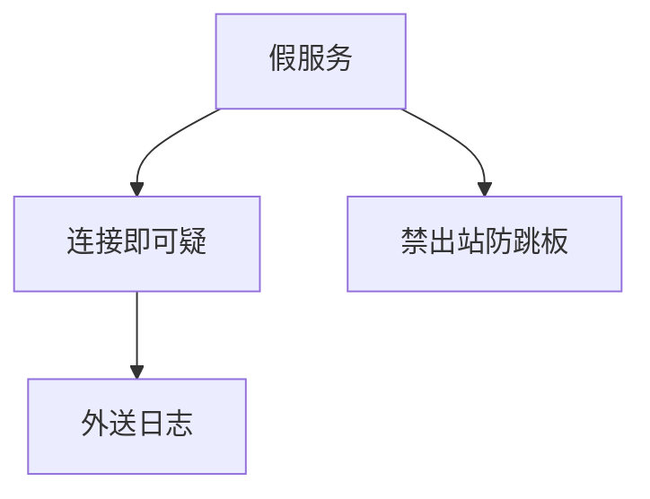

# 蜜罐

蜜罐是故意可发现的假系统：连上它的流量默认高可疑。它换来情报与低误报，前提是隔离足够，不被当成跳板打进真网。

<footer>—— 据 Spitzner, *Honeypots*；Lance Spitzner 对蜜网的实践陈述</footer>

## 定位

上一课[规则](/cs/ids-rules)误报高。缺口是**高置信触点**：没人该访问的地址。本课讲隔离与情报用途，不把蜜罐当诱捕违法的操作手册。

后课默认已经读完本课钉下的合同，只补差，不从该领域第一性原理重开。

## 问题

规则对扫描噪声吵。蜜罐：低交互模拟服务，高交互真系统但隔离。缺口是逃逸与污染：蜜罐被占则成跳板。

### 法律与伦理

观测要符合政策。本课不讨论诱捕执法。

Spitzner。禁止用蜜罐数据去报复。DDoS 下一课换可用性轴。

## 方法

分层交互。日志外送、禁出站。对照 IDS：蜜罐事件默认真，仍要防误触（扫描自己）。

图中节点是本课的机制骨架；课程不把图展开成可运行的攻击步骤。

## 机制

欺骗服务观测。不替代补丁。DDoS 下一课是可用性洪水，蜜罐帮不上容量。

前提写进合同之后，游戏外的误用只当失败模式点名，不在本课写成操作程序。

## 边界

不写高交互逃逸。DDoS 缓解下一课。

## 小结

- 规则吵；蜜罐触点默认可疑。
- 隔离与禁出站是前提。
- 换情报，不换容量。
- 下一课 DDoS 缓解。
- 出处：Spitzner, *Honeypots*。
