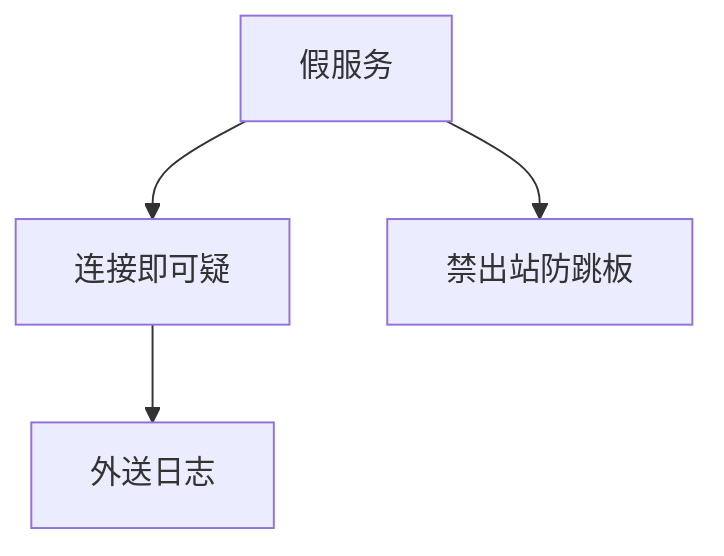

# 蜜罐

蜜罐是故意可发现的假系统：连上它的流量默认高可疑。它换来情报与低误报，前提是隔离足够，不被当成跳板打进真网。

<footer>—— 据 Spitzner, *Honeypots*；Lance Spitzner 对蜜网的实践陈述</footer>

## 定位

上一课[规则](/cs/ids-rules)误报高。缺口是**高置信触点**：没人该访问的地址。本课讲隔离与情报用途，不把蜜罐当诱捕违法的操作手册。

后课默认已经读完本课钉下的合同，只补差，不从该领域第一性原理重开。

## 问题

规则对扫描噪声吵：互联网背景流量里[端口扫描](/cs/port-scanning)与爆破恒定存在，规则要在其中挑真攻击，误报难压。蜜罐翻转前提：正常流量不该出现在这里，任何连接默认可疑，误报趋于零。低交互模拟服务（协议指纹、假文件系统），便宜量大但可被指纹识别；高交互真系统可观测完整攻击链。缺口是逃逸与污染：蜜罐被占则成跳板。

### 法律与伦理

观测要符合政策：监控告知范围、蜜罐日志里误触者的个人数据。本课不讨论诱捕执法。

Spitzner。禁止用蜜罐数据去报复。DDoS 下一课换可用性轴。现代变体是金丝雀令牌：假凭据、假 URL 埋进文档与配置，被读取即告警——把高置信触点缩到单个 token。

## 方法

分层交互按预算与风险：低交互铺面（全端口假服务），高交互收细节。隔离是硬约束：专用 VLAN 或网络命名空间（回 [分段](/cs/network-segmentation)），出站默认丢弃——抓到的样本不许回连；DNS、NTP 也与生产分开，防止蜜罐与真网互认；无真实凭据、无生产数据。日志外送 [SIEM](/cs/siem-logging)，本机日志默认不可信。误触来源要登记：内部扫描器与监控探测给蜜罐减噪。对照 IDS：蜜罐事件默认真，仍要防误触（扫描自己）。

```mermaid
flowchart TD
  FAKE["假服务"] --> HIT["连接即可疑"]
  HIT --> LOG["外送日志"]
  FAKE --> ISO["禁出站防跳板"]
```

图中节点是本课的机制骨架；课程不把图展开成可运行的攻击步骤。

## 机制

机制是概率不对称：真资产在地址空间占极小比例，随机扫到的几乎全是假资产，攻击者探测成本不变，防守者信号纯度陡升。产出两条线：情报（提取载荷、TTP 映射 [ATT&CK](/cs/mitre-attack)）与告警（进 [事件响应](/cs/incident-response) 流程）。失败模式：低交互指纹被识别后反成灯塔——攻击者据此绕开真网或投喂假情报；告警一多又被当噪声。欺骗服务观测。不替代补丁。DDoS 下一课是可用性洪水，蜜罐帮不上容量。

前提写进合同之后，游戏外的误用只当失败模式点名，不在本课写成操作程序。

## 边界

不写高交互逃逸。换情报不换容量，预算仍要先给补丁与基线。DDoS 缓解下一课。

## 小结

- 规则吵；蜜罐触点默认可疑。
- 隔离与禁出站是前提。
- 换情报，不换容量。
- 下一课 DDoS 缓解。
- 出处：Spitzner, *Honeypots*。
