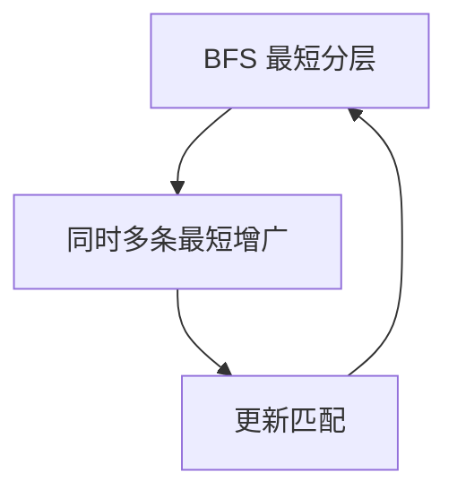

# Hopcroft–Karp

二分图上一次 BFS 找出全体最短增广路，再 DFS 同时增广，相位 $O(\sqrt V)$，总 $O(E\sqrt V)$。

<footer>—— 据 Hopcroft and Karp, An $n^{5/2}$ Algorithm for Maximum Matchings in Bipartite Graphs, 1973；CLRS 第 26.3 节整理</footer>

上一课[最小割的建模](/cs/min-cut-applications)把划分交给最大流。主干[二分图匹配](/cs/bipartite-match)已用单位容量流给出最大匹配。缺口是**更快的增广组织**：Hopcroft–Karp 与单位网络上 Dinic 同类，不把每条交错路单独 BFS 到底。不重写 König。后课带权匹配。

## 问题

匈牙利：一次找一条增广路 $O(E)$，最多 $V$ 次，$O(VE)$。Hopcroft–Karp：残量（自由点、$L\to R$ 非匹配、$R\to L$ 匹配）上 BFS，只保留到自由 $R$ 的最短距离分层；再在分层里 DFS 找极大一组**顶点不交**的最短增广，同时翻转。相位数 $O(\sqrt V)$：短增广做完后，剩余增广至少长 $\sqrt V$ 量级，条数受匹配规模限制。总 $O(E\sqrt V)$。

缺口是「一批最短」，不是新的匹配定义。Berge 增广路定理仍是正确性根。

### 与 Dinic 同一张分层

单位容量 $s$–$L$–$R$–$t$ 上 Dinic 的阻塞流，在二分匹配里就是这批最短增广。本课用匹配语言写，便于后课 KM、带花对照。不要声称一般图也 $O(E\sqrt V)$——一般图要 Micali–Vazirani 等，更重。

Hopcroft–Karp 1973。Dinic 1970 更早给出分层阻塞流。CLRS 26.3 用流，竞赛实现常写 HK 的 BFS+DFS。后课 Kuhn–Munkres 处理权。

## 方法

重复：从全体自由 $L$ BFS 分层，若无自由 $R$ 则停。DFS 从自由 $L$ 沿层 $+1$ 边增广，点用过即占用。翻转匹配边。直到 BFS 失败。

实现注意：一轮内每个点至多一次。

## 机制

最短增广长度不减。一轮吃掉该长度的极大不交组后，下一轮更长。分析把相位分成「短于 $\sqrt V$」与之后，得到 $O(\sqrt V)$ 轮。与普通匈牙利比，只改调度，不改交错路翻转。

稠密图 $E=\Theta(V^2)$ 时 $O(V^{2.5})$，仍优于 $O(VE)$。

## 边界

本课不写一般图匹配、不写带权。不把 Hall 条件再证一遍。后课默认：二分最大基数匹配实用 $O(E\sqrt V)$。下一课 KM / 匈牙利带权。

## 小结

- 一批最短增广 = 二分匹配的 Dinic。
- $O(E\sqrt V)$；正确性仍是增广路定理。
- 一般图不是本课的界。
- 出处：Hopcroft and Karp, 1973。
