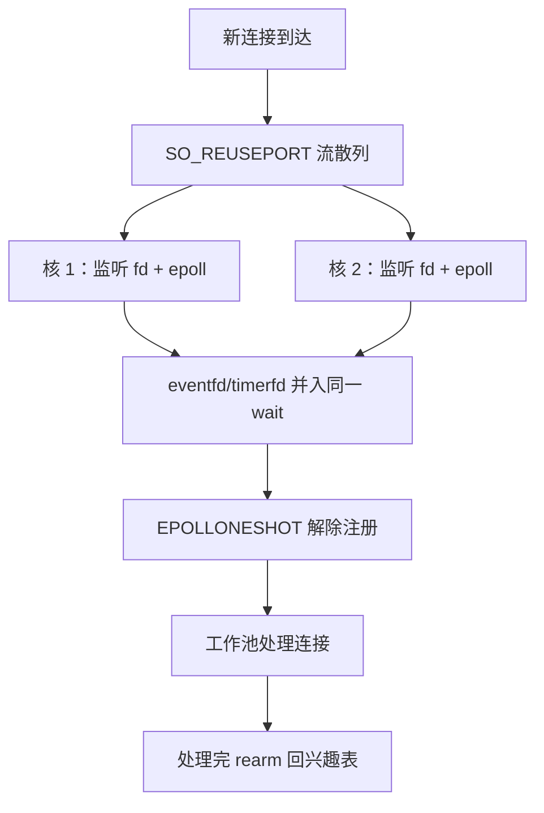
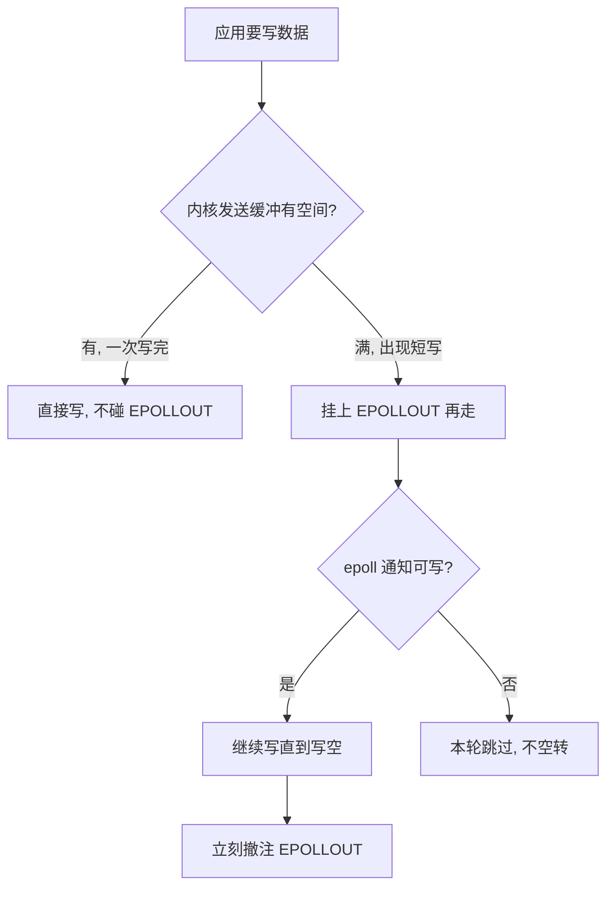

# epoll 的深化

万级连接之后，epoll 的成本不在 wait 本身，而在惊群唤醒、跨核缓存失效与每个事件陪跑的那次系统调用。

<footer>—— 据 Linux `epoll(7)`、`accept(2)` 手册；Kerrisk, *The Linux Programming Interface* 整理</footer>

[上一课](/cs/par-roofline-map)给「并行计算模型」收束：点要用实测字节算，脊点 $I^{*}=F/B$ 量化向量化值多少，优化先爬到屋顶再右移强度，work-span 与 roofline 并读——模型给上限与正确性，机器给墙。算力与并行的账翻完，瓶颈移到 I/O 的入口：连接数与事件率继续上升时，事件循环本身成为新的共享点：accept 的惊群、就绪事件的重复唤醒、定时器与线程间唤醒怎么并进同一个循环、就绪连接怎么交给工作线程。本课写这些深化的做法，后课默认事件循环已经可以分片扩展。

## 问题

惊群有两处。accept 惊群：多个线程阻塞等新连接，一个连接唤醒所有，只有一个 accept 成功，其余白付一次调度与缓存污染；wait 惊群：多线程 wait 同一 epoll，LT 下同一就绪 fd 还可能唤醒多个等待者。治理谱系有三档：`EPOLLEXCLUSIVE`（内核 4.5 起）把唤醒降为只叫一个等待者；`SO_REUSEPORT` 让多个监听套接字共享同一端口，内核按流散列分发，惊群从根上消失，代价是没有全局视图、负载可能不均；`EPOLLONESHOT` 管交接——就绪 fd 交给工作池处理时，事件一次后自动解除注册，处理完 rearm，把「正在处理」编码进注册状态而不是应用锁。不这么做会错在哪：省掉 ONESHOT，两线程同时读写同一连接的正确性只能靠锁兜底，锁又把分片买来的并行度收了回去。

术语翻译：惊群（thundering herd）就是「门铃一响全楼都醒」——内核把等在同一事件上的线程全叫起来，结果只有一个真有活干，其余白付一次上下文切换和缓存污染。

## 方法

单核循环的完整形态是把所有异步源收进一张兴趣表：eventfd 收线程间唤醒，timerfd 收定时器，signalfd 收信号，一次 wait 管全部。分片按核切：每核一个 epoll、一个循环；监听端用 SO_REUSEPORT 散列，或共享监听 fd 配 EPOLLEXCLUSIVE。写路径要「按需注册」：只在有数据要写时挂 EPOLLOUT，写空立刻撤注，LT 下不留常亮事件空转；读路径遵守[阻塞与非阻塞套接字](/cs/socket-nonblock)的约定，ET 读到 EAGAIN、容忍短写。下游变慢时，背压的真正水位在应用层待写队列，接回[套接字缓冲与背压](/cs/socket-buffers)的口径，不能只看内核缓冲。

## 机制

分片把连接固定到核上：无锁、缓存亲和，代价是失去全局视图——某核分到的连接全是热点流时，只能靠散列重洗或显式迁移连接，迁移本身又是一次 ONESHOT 交接。rearm 是一次 `epoll_ctl` 调用，事件率高时它自己进入成本表；等价替代是工作池处理完毕后再注册，语义相同，差在由谁付这一次调用。EPOLLEXCLUSIVE 只保证「一个事件只唤醒一个等待者」，同一轮多个 fd 都就绪时仍可能有额外唤醒，把它当成「惊群已根除」是常见误读。

常见误区：以为 LT（水平触发）的「没处理完就一直提醒」是免费保险。套接字几乎恒可写时，常亮的 EPOLLOUT 每轮都报告，事件循环被空转占满——这正是写路径要「写空即撤注」的原因。

写路径「按需注册」的一生：

SO_REUSEPORT 按四元组散列分流，同一连接恒定落同一核；运行期增删监听 fd 会引发连接重分布，重分布的连接被发到新套接字的循环上，应用层要么容忍乱序交接，要么自己做连接迁移。

## 边界

本课不引入提交完成模型，io_uring 是下一课；不写 nginx、Seastar 等框架的实现对照，不写 epoll 对非常规文件类型（部分设备 poll 实现粗糙）的坑。数量级上，单核循环的吞吐由每事件系统调用数决定：每事件两次陷入的模型，事件率上去之后，陷入本身开始排满预算——这正是下一课要从模型层面换掉的假设。

数字实例：每事件若付 2 次系统调用（wait 加 rearm 的 ctl），百万事件每秒就是 200 万次陷入；按每次 1–2 μs 算，仅系统调用就吃掉两三个核的预算——「陷入排满预算」说的就是这个数量级。

## 小结

- 惊群分 accept 与 wait 两处；EPOLLEXCLUSIVE、SO_REUSEPORT 是两条治法，EXCLUSIVE 不等于根除。
- eventfd/timerfd/signalfd 把唤醒、定时、信号并入一个 wait，事件循环才算完整。
- ONESHOT 用注册状态编码「正在处理」，交接不靠应用锁；rearm 的 ctl 调用是高频下的可见成本。
- 分片买并行度、卖全局视图；连接迁移是付回来的一笔。
- 出处：Linux `epoll(7)`、`accept(2)`、`socket(7)`；Kerrisk, *The Linux Programming Interface*；Stevens, *UNIX Network Programming*。
