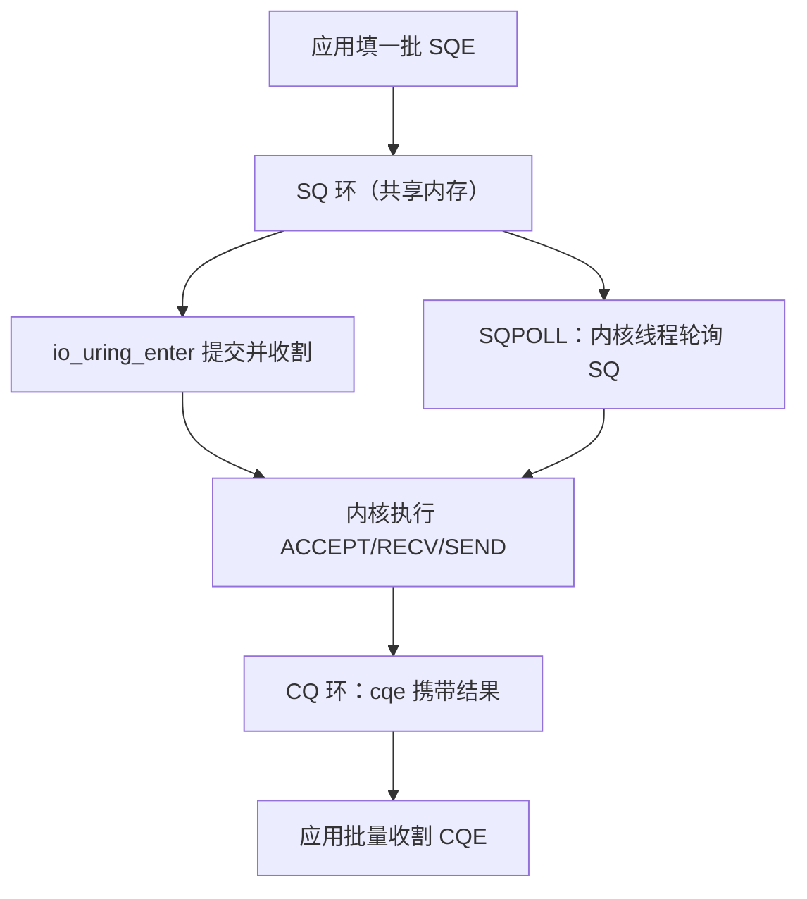
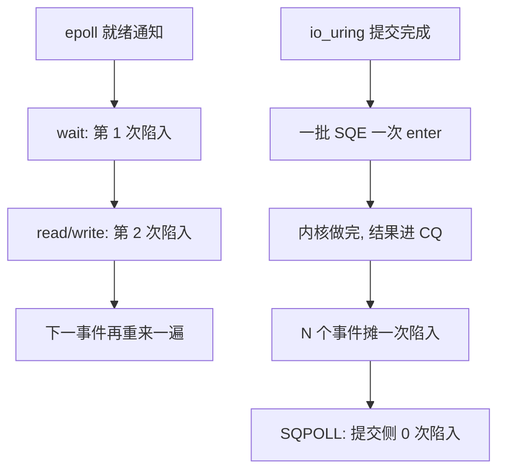

# io_uring

就绪通知回答「现在能做吗」，提交完成回答「帮我做完」；从前者换到后者，省的是每个事件陪跑的那一次陷入。

<footer>—— 据 Axboe, *Efficient IO with io_uring*, 2019；liburing 手册整理</footer>

[上一课](/cs/hpc-epoll-deep)把事件循环分片、治理了惊群、把定时与唤醒并进一个 wait，但模型仍是就绪通知：wait 说可读，应用还得再发一次 read。[io_uring](/cs/io-uring) 已在主干钉了共享 SQ/CQ 环的骨架与 VFS 侧的语义；本课深化的是把它当网络 I/O 模型用时的账——每事件系统调用数怎么降、哪些特性在哪个内核版本才有、什么负载其实不受益。

## 问题

就绪通知的每事件下界是两次陷入：一次 wait，一次 read/write。事件率到百万级每秒时，陷入与上下文切换本身占掉可观 CPU，[上一课](/cs/hpc-epoll-deep)末尾正是把这一点留作缺口。io_uring 的 SQE 与 CQE 都在共享内存上：一次 `io_uring_enter` 提交一批、收割一批，摊销后每事件不足一次陷入；SQPOLL 模式由内核线程轮询 SQ，连 enter 都省掉。不这么做会错在哪：把它当「快版 epoll」，只是把 recv 换成异步写法，每事件仍是提交一次、收割一次、等待一次，摊销没有发生；或者提交后不等 CQE 就复用缓冲，内核把数据写进你已经开始改写的页。

直觉类比：就绪通知像外卖到了只发短信「可以取了」，你还得自己跑一趟（read）；io_uring 像跟代收点说「这十单都帮我收好」，一次出门全提回来——出门次数（陷入）被批量摊薄。

## 方法

网络化的关键特性有四件。multishot accept：一次提交长期收割新连接，不必每条连接重新提交；multishot recv：内核把就绪数据直接随 CQE 附带缓冲送达，省去逐次提交读请求；注册缓冲与注册文件表把 fd 数组与缓冲池钉在内核，免掉每次引用计数；`IOSQE_IO_LINK` 把 accept → recv → send 串成链，一批 enter 全部下发，依赖由内核保证顺序。发送用 SEND，配 SEND_ZC 走零拷贝路径。基本循环：填一批 SQE → enter 提交并顺带收割 → 处理 CQE → 循环；SQPOLL 打开后提交侧无系统调用。

## 机制

收益按来源分解：环消除参数拷贝，批量消除陷入次数，注册表消除 fd 引用管理，完成模型消除「就绪但 EAGAIN」的竞态——提交的就是具体请求，短读短写以 cqe 的结果字段表达，不在 errno 里。不受益的负载同样要认清：低事件率时环的固定成本没有对手可摊；单连接大文件顺序读写本来陷入就不占大头。版本账必须对表：io_uring 自 5.1 进主线，multishot、SEND_ZC、SQPOLL 的可用性与成熟度散布在 5.19、6.0 及以后，按目标内核逐项核对再设计。安全面也是账目的一部分：内核漏洞频发，Google 已宣布自 Android 14 起收紧 io_uring，把它当攻击面来管理，不是一句「性能更好」能带过的。

两种模型每事件的陷入对账：

数字实例：epoll 模式百万事件每秒约 200 万次陷入；io_uring 一次 enter 提交并收割各 256 个事件，陷入降到约 4000 次；SQPOLL 打开后提交侧归零——这就是「每事件不足一次陷入」的算术。

一次 enter 可提交与收割各数百个 SQE/CQE，摊销系数随批次走；SQPOLL 空转也烧 CPU，生产上按事件率动态开关，或配 `sq_thread_idle` 让内核线程空闲后让出。

## 边界

本课不重写文件 I/O 与页缓存的交互（主干 [io_uring](/cs/io-uring) 已及 VFS 权限与 bio 路径），不写 eBPF 与 io_uring 的组合。当包率高到一次陷入都嫌多、连 VFS 层都想跳过时，路径要从协议栈整体拿掉——内核旁路是下一课。

常见误区：以为 io_uring 对所有负载都快。低事件率时环的建立与固定成本没人摊；单连接顺序读写本来陷入就不占大头——它省的是「每事件陪跑的陷入」，你的负载若没有这笔账，就享受不到这笔折扣。

## 小结

- 就绪通知每事件两次陷入；提交完成摊销后不足一次，SQPOLL 可到零。
- multishot、链接 SQE、注册缓冲与文件是网络化的关键特性，按内核版本对表启用。
- 完成模型消除就绪-读取竞态，短读短写在 cqe 结果里，不在 errno 里。
- 低事件率与单连接负载不受益；io_uring 同时是一张需要管理的内核攻击面。
- 出处：Axboe, *Efficient IO with io_uring*（2019）；liburing 与 Linux 内核 io_uring 文档。
