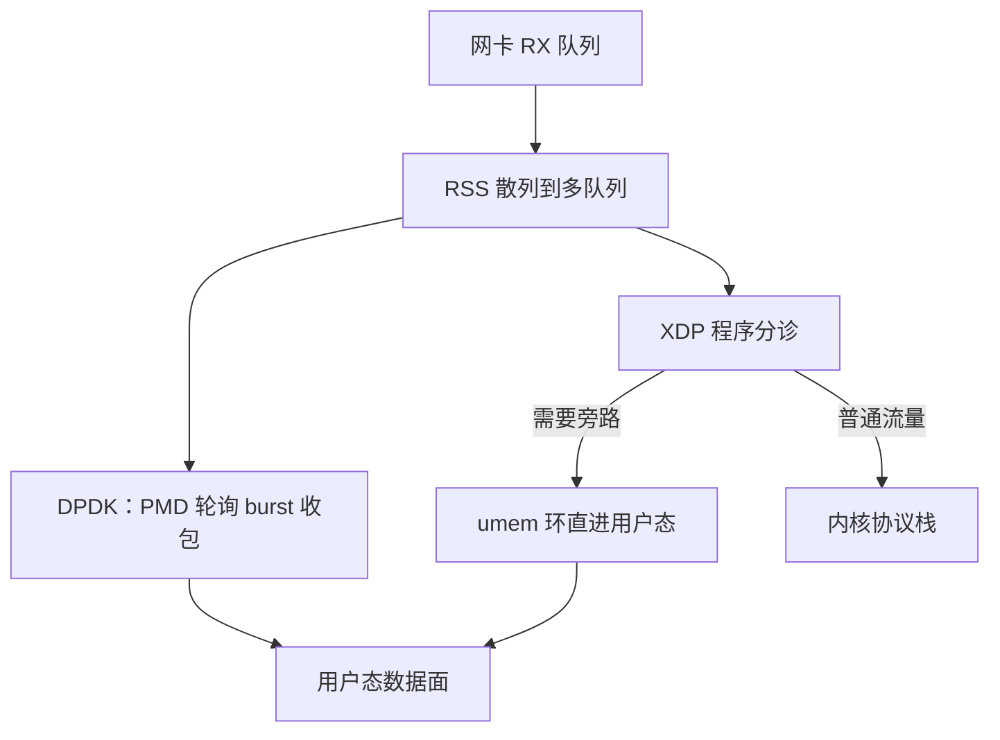

# 内核旁路：DPDK 与 AF_XDP

包率把每包预算压进几百纳秒后，优化路径的尽头是缩短路径：把协议栈从数据面上拿掉。

<footer>—— 据 DPDK 官方文档；Linux 内核 AF_XDP 文档整理</footer>

[上一课](/cs/hpc-io-uring)把陷入摊销到共享环上，但每个包仍要完整走过内核协议栈：中断、软中断、skb 分配、逐层解析。主干已有[内核旁路 DPDK](/cs/dpdk-kernel-bypass) 与 [XDP 与 eBPF 网络](/cs/xdp-ebpf)两课，分别钉了用户态轮询与驱动层 eBPF 的机制；本课把两者放进同一张账：完整旁路与折中旁路各自的真实成本、各自的失败方式，以及低延迟业务怎么选。

## 问题

先算预算：64 字节小包在 10 GbE 线速约 14.88 Mpps，均摊每包不足 70 ns，而一次跨核缓存失效就是几十纳秒量级——内核路径每包的中断处理与协议栈工作远超此数，栈本身成了最大单项成本。DPDK 是完整旁路：VFIO 把网卡寄存器映射进用户态，PMD 线程以轮询代替中断，描述符环与缓冲建在 hugepage 上，数据面里没有内核。AF_XDP 是折中旁路：XDP 程序在驱动层分诊，需要旁路的帧经 umem 环直进用户态，其余交回内核栈，网卡管理、过滤与统计仍由内核承担。不这么做会错在哪：把旁路当提速开关而保持「每包一次处理」的代码结构，批处理与核亲和的收益全部丢失；或者忘了轮询在低包率时段烧满核——旁路方案在深夜低峰可能比中断更贵。

## 方法

DPDK 侧的流水线：网卡绑到 vfio-pci → mempool 与收发环建在 hugepage → RSS 把流散到多队列，每核一条 PMD 绑一个队列 → 主循环一次 burst 收 32 或 64 包，批内摊销。AF_XDP 侧：加载 XDP 程序做分诊，XSK 的 umem 以 fill/completion 与 RX/TX 双组环推进，生产者-消费者语义由内存序保证；不需要的包 redirect 回内核，保住既有协议栈与工具链。选型判据三条：核能否专用、要不要内核服务、目标包率离线速多远。量化栏的[主机托管与微波](/quant/colocation-microwave)把物理距离当延迟预算建模；内核旁路是同一逻辑在机器内部的一层——路径每长一截，账上就多一项。

## 机制

省下来的不只是系统调用：是每包两次跨越用户/内核边界的拷贝与缓存失效，是中断聚合在高包率下反而添上的延迟抖动——旁路方案常直接关掉聚合，用轮询的确定性换掉抖动。批处理把每包固定成本摊到整批；队列与核一一对应消灭锁与跨核迁移。代价同样是机制性的：核被独占后与调度器的协作消失；内核统计看不见了，可观测性要自建；漏洞与升级路径收窄。AF_XDP 折中的定价清单：多付一次 XDP 程序执行与 umem 环形管理，换回内核服务与可移植性——两课主干机制在此互补而非竞争。

10 GbE 64 字节线速 $\approx 14.88$ Mpps：$10^{10}/((64+20)\times 8)$，加的 20 字节是前导与帧间隙。每包 70 ns 的预算里，批处理与缓存亲和不是优化项，是及格线。

## 边界

本课不重写 XDP 程序的 verifier 与 map 机制（[XDP 与 eBPF 网络](/cs/xdp-ebpf)已钉），不写 DPDK 的 vhost/virtio 虚拟化数据面（[半虚拟化](/cs/paravirtualization)的对象），不写具体转发应用。跨机之后还剩什么：两端的 TCP、上下文与拷贝仍在——RDMA 是下一课。

## 小结

- 线速把每包预算压进几十纳秒，内核协议栈本身成为最大单项成本。
- DPDK 完整旁路换线速与窄延迟分布，卖掉核的可复用与内核服务；AF_XDP 折中保留内核，多付一次分诊。
- 旁路收益的大头是批处理与核队列亲和，不是「省掉的系统调用」。
- 低包率时轮询更贵、零拷贝未必更快；旁路是负载形态的函数，不是无条件的快。
- 出处：DPDK 官方文档；Linux 内核 AF_XDP/XDP 文档。
