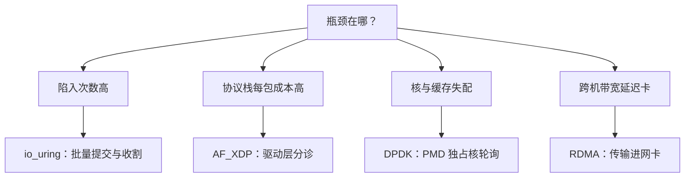
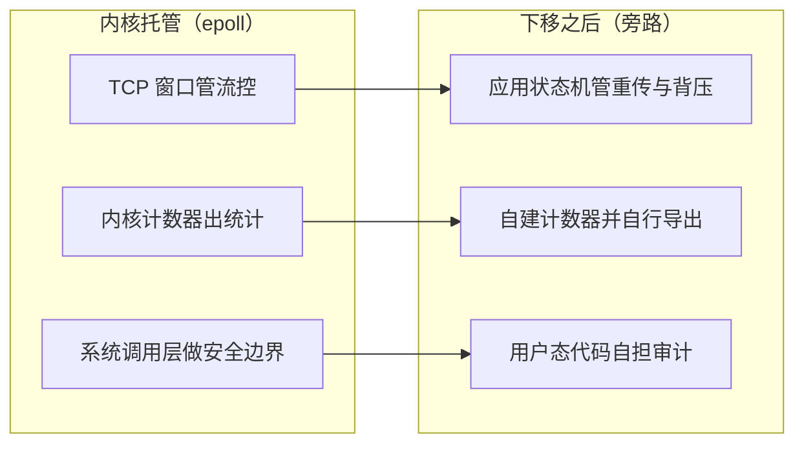

# 高性能网络收束

每下移一层路径，就把内核替你做的一件事接过来自己做；选型是用运维复杂度买延迟与包率。

<footer>—— 据 io_uring、DPDK、AF_XDP、RDMA 各自官方文档的取舍陈述整理</footer>

[上一课](/cs/hpc-zerocopy-latency)把零拷贝的收益与测量的纪律钉在一起：先知道省在哪，再谈省了多少。本课程到此收束：本课把五课的路径拼成一张选型账，明确每条路径适合的负载、真实代价与失败方式，最后收在共同原理上。

## 问题

决策变量从来不是「哪个最快」，而是四个：每秒事件与包数、消息大小、延迟预算与尾部要求、可接受的复杂度。[课程第一课](/cs/hpc-epoll-deep)的分片事件循环覆盖万级连接的通用服务，内核全托管，代价最小；

术语翻译：「陷入」（trap）就是用户态程序每次请内核办事的一次往返——保存现场、切进内核、办完再回来。epoll 模式下每个就绪事件至少来回两趟，这笔按次收取的「固定税」正是 io_uring 与旁路方案要摊销的东西。[io_uring](/cs/hpc-io-uring) 在陷入次数成为瓶颈时接管批量 I/O，代价是版本碎片与攻击面；AF_XDP 在包率逼近线速、协议栈每包处理本身成为成本时介入；[内核旁路：DPDK 与 AF_XDP](/cs/hpc-kernel-bypass) 的完整旁路在核可专用时换线速与窄分布；[RDMA](/cs/hpc-rdma) 在跨机带宽与延迟成为瓶颈、且有专用网络时把对端操作系统也请出局。

## 方法

选型按瓶颈位置走，先测后选：卡在系统调用次数 → io_uring；卡在协议栈每包成本 → AF_XDP；卡在核与缓存亲和 → DPDK；卡在跨机带宽延迟 → RDMA。动手下移之前，按上一课的测量纪律拿到可信的延迟分布与每包成本，否则选型本身就在未测量的假设上进行。五条路径的共同原理是摊销每事件固定成本：批处理摊陷入，核亲和摊缓存失效，专用无损网络摊重传——每下移一层，都是把「每次都付的固定税」改写成「一次付清的固定成本」。

## 机制

下移的机制含义：内核职责不会消失，只会改名。错误处理从内核协议栈变成应用状态机；流控从 TCP 窗口变成 PFC 或应用背压；统计从 netns 计数器变成自建计数器；安全边界从系统调用层变成要审计的用户态代码。选型错误也各有名字：用未分片的 epoll 跑线速，扫描与陷入淹没 CPU；用 DPDK 跑凌晨低峰，轮询烧核；用 RoCE 却不管 PFC 配置，无损网络自己死锁；只报平均延迟，尾部问题被平均掉。量化栏的[主机托管与微波](/quant/colocation-microwave)是这张阶梯在另一栏的极端读者：软件路径走到尽头后，剩下的延迟在光纤与微波里——那是物理的账，不在本课程之内。

「改名」具体怎么改？把内核托管与旁路之后各职责的去向对照着看：

数量级锚点：就绪通知每事件 2 次陷入；io_uring 批量摊销后不足 1 次；DPDK 把每包压进数百纳秒但独占核；RDMA 同机房 RTT 约 1–2 μs。跨栏对照：量化交易的托管与微波把「路径长度」当预算，与本课程同一套逻辑。

## 边界

本课程不写具体服务框架（nginx、Envoy、Seastar）的选型对照，不写云网络虚拟化的数据面，不进入传输层协议细节的再推导；旁路方案的安全与调试代价是选型的一等输入，不是脚注。本课程到此收束。

常见误区：只看平均延迟。均值 100 μs 听着不错，但若 p99 是 2 ms，等于每 100 个请求就有 1 个慢 20 倍——在交易与广告竞价里，这一小撮恰恰是盈亏分界。选型依据必须是分位数，不是均值。

## 小结

- 选型按瓶颈位置：陷入 → io_uring，每包成本 → AF_XDP/DPDK，跨机 → RDMA；先测后选。
- 每下移一层，内核职责改名由你承担：状态机、背压、计数器、安全审计。
- 旁路与零拷贝是负载形态的函数：低包率轮询更贵，小包零拷贝更贵。
- 测量纪律先于优化：打点位置、残余钟差、尾部分位，缺一项结论不成立。
- 从软件路径再往下，延迟在光纤与微波里；那是物理的账，不属本课程。
- 出处：Linux epoll/io_uring/AF_XDP/RDMA 各自文档；DPDK 文档；据各官方取舍陈述整理。

直觉类比：五条路径像通勤方式——epoll 是公交（便宜、拥挤但省心），io_uring 是拼车（几件事合一次出行分摊固定费），DPDK 是包一辆专车（随叫随到，空驶也得付车钱），RDMA 是两端直达的专线（路上不堵，但要先修轨道）。没有最好，只有跟负载合不合身。
