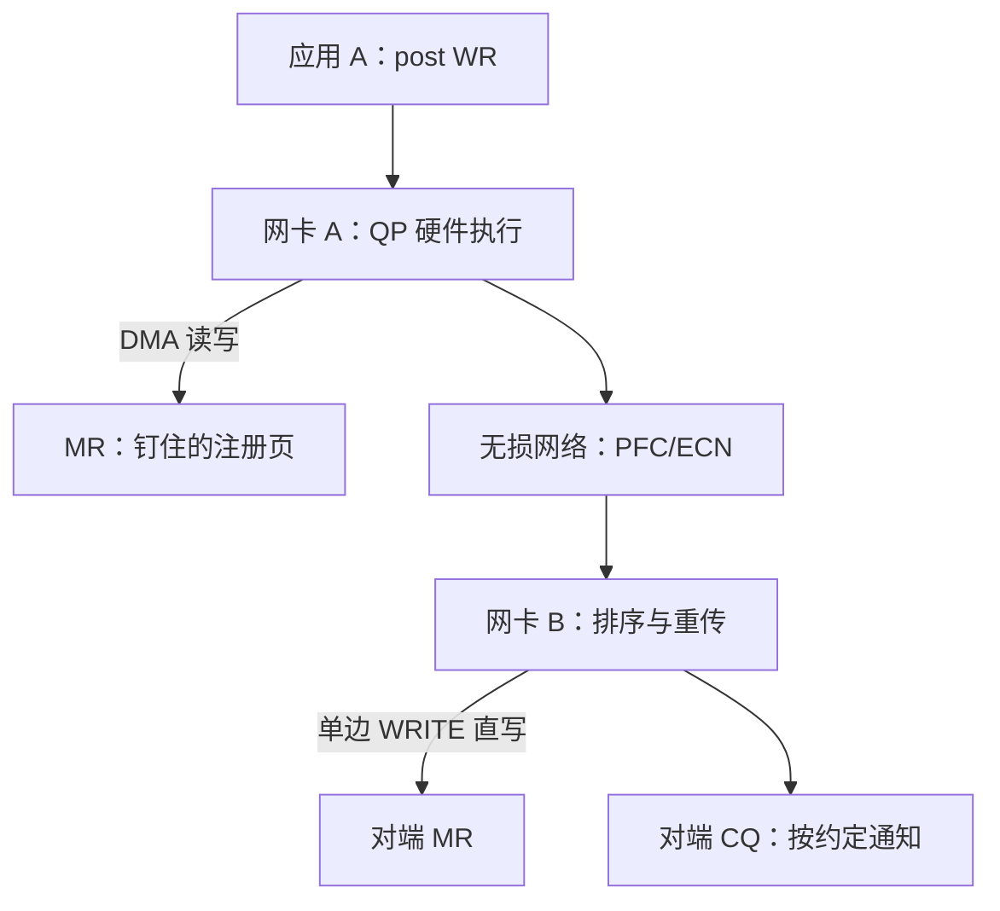

# RDMA

内核旁路只绕开本机的栈；RDMA 把对端机器上的操作系统也从数据路径上请了出去。

<footer>—— 据 IBTA InfiniBand 架构规范；rdma-core 文档整理</footer>

[上一课](/cs/hpc-kernel-bypass)把本机协议栈从数据面拿掉，包直接进用户态缓冲；但两台机器之间，TCP 仍要在双方内核里各走一遍。[RDMA 在 OS 中的位置](/cs/rdma-os)已在主干钉了骨架：内核管注册与 QP，数据 DMA 进用户内存。本课深化数据面本身：verbs 的双边与单边语义、注册内存的纪律、无损网络为什么是前提，以及完整的代价清单。

## 问题

旁路之后，端到端延迟里还剩什么：对端的内核 TCP、两端的上下文切换、缓冲区之间的拷贝，以及丢包后以十毫秒计的重传。RDMA 把传输卸载进网卡：QP 状态与重传逻辑在硬件里执行，verbs 从用户态写门铃寄存器、不陷内核，DMA 直接读写两端注册过的内存。双向延迟落到微秒量级，CPU 近乎不参与。不这么做会错在哪：把 RDMA 当快版 socket，只用双边 SEND/RECV，每条消息都要对端先贴好接收缓冲，单边语义「对端 CPU 不参与」的收益全部丢失；或者内存注册完又交给会迁移页的子系统，DMA 写进的是失效页——这是正确性事故，不是性能问题。

## 方法

对象链一次建齐：保护域 PD → 注册内存 MR（钉页、取 lkey/rkey）→ 队列对 QP → 完成队列 CQ。收发：应用 post 一个 WR 进 SQ，网卡异步执行，从 CQ 轮询或等事件收割 CQE。语义分两族：SEND/RECV 双边，对端 RQ 必须预先贴好缓冲，逐条消耗；RDMA WRITE/READ 单边，发起方直接写读对端 MR，对端 CPU 全程不参与，完成通知靠约定——写完在末尾翻转标志，或补发一个 SEND 作信号。传输族三选：InfiniBand 走专用链路；RoCE v2 跑在 UDP/IP 上，靠 PFC 优先级流控与 ECN 把网络做成无损；iWARP 走 TCP。GPU 场景配 GPUDirect RDMA，网卡直接读写显存，省掉经主存的转运拷贝。

## 机制

CPU 不参与仍不失序的机制在于：有序、重传、流控全部在网卡固件里，QP 状态机硬件执行；无损网络把「丢包后重传」换成「上游按优先级暂停」，PFC 在链路层掐住，ECN 与 DC-QCN 把拥塞反馈回发送端。注册内存是钉住的账目：物理页不可回收，大 MR 直接吃掉可用内存，注册与撤销本身昂贵，池化与长期注册因此是常态。量级锚点：同机房双向延迟在厂商公开指标里约 1–2 μs，比内核 TCP 的数十微秒低一个数量级；代价清单的另一头是 PFC 的死锁与头阻塞——优先级配置错配时，无损网络会自己把自己拥塞死。

lkey/rkey 是 DMA 的地址翻译凭据：网卡拿 key 访问物理页，不经页表。THP 合并、内存迁移、容器换宿主都会让「注册过的页」位移，生产事故常出在注册之后又把同一块内存交给会移动页的路径。

## 边界

本课不写集合通信库的拓扑与路由（那是 NCCL 内部的事），不写 NVMe-oF 存储路径，不重讲[零拷贝网络](/cs/zero-copy-network)已钉的钉页与 DMA 原理。下一课回到通用路径：零拷贝与旁路省下的时间，要靠测得准才能兑现成结论。

## 小结

- verbs 数据面：PD/MR/QP/CQ，用户态门铃，传输由网卡硬件执行。
- 双边 SEND/RECV 要对端贴缓冲；单边 WRITE/READ 让对端 CPU 离场，通知靠约定。
- 无损网络（PFC/ECN）是 RoCE 的前提，同时引入死锁与头阻塞的新风险。
- 注册内存是钉住的账：页不可回收、注册昂贵、GPU 要 GPUDirect 才不绕主存。
- 出处：IBTA InfiniBand 架构规范；rdma-core 文档；厂商公开延迟指标。
