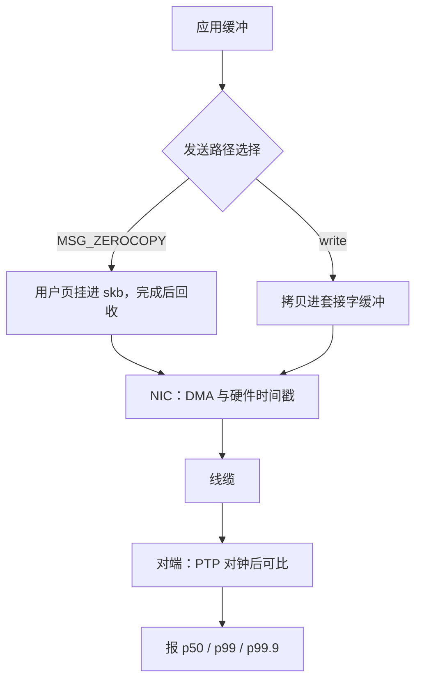

# 零拷贝与延迟测量

省一次拷贝省的是几百纳秒；时间戳打错一个位置，结论能假出一个数量级。

<footer>—— 据 Linux `timestamping` 文档与 IEEE 1588（PTP）整理</footer>

[上一课](/cs/hpc-rdma)把跨机路径压进网卡，前提是专用网络与注册内存；多数服务仍在通用栈上，能省的是拷贝，能信的是测量。[零拷贝网络](/cs/zero-copy-network)已在主干钉了拷贝的来源与 sendfile、MSG_ZEROCOPY、AF_XDP 三个接头；本课不重复词条，写两件事：通用发送路径上零拷贝的真实取舍，以及省下来的时间如何被诚实地量出来。

## 问题

零拷贝在发送方向收益明确，接收方向困难。发送可以把用户页直接挂进发送路径：MSG_ZEROCOPY 免掉缓冲到 skb 的拷贝，但页在网卡完成前不能复用，完成通知走异常队列，应用必须专门收割——忘了收割就是页泄漏。小包更微妙：内核对小于阈值的包直接拷贝，因为管理页引用的元数据开销超过拷贝本身，「零拷贝一定更快」在小包高频场景是反的。测量侧的坑一串：跨机用系统时钟相减，钟差就有几十微秒；批量压测把排队延迟摊进平均值，报出的「平均延迟」掩盖尾部；中位数漂亮而 p99 爆炸的分布比比皆是。不这么做会错在哪：优化前后用不同位置的软件时间戳相减，得到的提升可能只是打点位置变了。

## 方法

打点分三层：NIC 硬件时间戳最接近线缆（SO_TIMESTAMPING 请求），驱动打点次之，纯软件打点含协议栈噪声。跨机对钟用 PTP（IEEE 1588），并把残余同步误差一并报出。指标报分布不报均值：p50、p99、p99.9 与最大值，注明采样窗口与负载形态；吞吐与延迟分开测，[ping / iperf](/cs/network-measurement) 给的是基线口径，负载上升时排队延迟与利用率同向增长，两条曲线不能混。对照实验钉死变量：同一打点位置、同一批大小、关掉 Nagle（TCP_NODELAY）与中断聚合这类会移动分布的旋钮再比较。

## 机制

测量的机制定义：延迟是因果链上两个事件的间隔，误差等于打点误差加打点位置到物理事件之间的剩余路径。硬件时间戳把打点推进到 MAC 层，剩余路径最短；软件时间戳含调度与软中断噪声。所以延迟数字必须连打点位置一起报，否则数字没有语义。零拷贝的机制账：省的是拷贝与随之而来的缓存失效，付的是页管理、完成通知与代码复杂度；接收方向头解析仍要 CPU 碰数据，小包直接拷贝反而便宜，阈值随平台与 MTU 变动。分布形态本身也是信号：轮询的旁路路径窄而稳，中断路径常呈双峰——聚合窗口内与外的包延迟不同，均值会把两种机制搅成一台账。

Nagle 算法与延迟确认叠加可引入约 40 ms 量级的假尖峰：小包被扣住等 ACK 才能发出。压测前先开 TCP_NODELAY 关掉 Nagle，再逐个打开其余旋钮归因。

## 边界

本课不写 PTP 的报文与时钟伺服细节，不写硬件抓包仪；量化栏[主机托管与微波](/quant/colocation-microwave)钉过「研究必须声明接入与介质」，本课的对应纪律是「结论必须声明打点位置」。下一课收束全课程。

## 小结

- 发送方向零拷贝收益明确但要管页生命周期；小包低于阈值时拷贝反而便宜。
- 延迟是因果链两事件之差；报数字必须同时报打点位置与残余时钟误差。
- 分布重于均值：p99/p99.9、负载形态、批量与排队效应一起报。
- Nagle、中断聚合、批大小都会移动分布，对照实验要钉死这些旋钮。
- 出处：Linux `SO_TIMESTAMPING`/`timestamping` 文档；IEEE 1588；测量实践。
