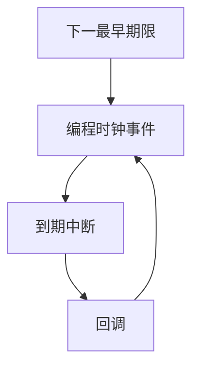

# hrtimer

高精度定时器按绝对或相对纳秒期限排队；到期时靠时钟事件设备中断，而不是等下一个 HZ 滴答。

<footer>—— 据 Gleixner 对 Linux hrtimer 的设计；POSIX clock_nanosleep 整理</footer>

[上一课](/cs/jiffies)的粒度是毫秒级。[实时调度](/cs/realtime-sched) 需要更紧的唤醒。[io_uring](/cs/io-uring) 与 epoll 的超时若只对齐滴答，尾延迟差。缺口是 **hrtimer**：独立于 timer wheel 的期限队列，加上可编程的下一中断时刻。

## 问题

提高 HZ 会增加中断负荷，仍是均匀滴答。无滴答内核在空闲时甚至关掉周期性 IRQ。缺口：把下一个最近期限编程进时钟事件设备；到期只跑那个回调；没有期限时可以睡到下一事件。软件侧用红黑树（或时间线）按到期排序。用户 `clock_nanosleep(CLOCK_MONOTONIC, TIMER_ABSTIME, …)` 走这条。

本课不把 clocksource 与 clockevent 的驱动列表背完。

slack 允许内核把期限稍微合并以省中断。实时任务可以要最小 slack。与 jiffies 定时器并存：粗的仍走 wheel，细的走 hrtimer。

## 方法

注册 hrtimer：给定 ktime 与回调。内核计算最早期限，编程设备。IRQ：执行到期回调（可唤醒进程、推进网络重传等），再编程下一期限。回调不可长时间占 CPU，重活丢工作队列——对接已有下半部课。不要用 hrtimer 在回调里做阻塞 I/O。

## 机制

hrtimer 把时间从「节拍计数」升级为「事件驱动的期限」。调度器的高精度抢占、TCP 细超时、用户 nanosleep 共用。它不取代 jiffies 记账；CFS 仍可按纳秒差更新 vruntime，来源可以是同一 clocksource。与组成课的锁存器无关。

## 边界

本课不保证在虚拟机里能得到主机级精度。不引入 timerfd 的全部接口，只承认期限可变成 fd 上的可读。下一课：字符设备上的人机接口——终端与伪终端，shell 与 SSH 都靠它。

后课默认：内核可按纳秒期限唤醒。字节流的终端行规程与 PTY，下一课 tty。

## 小结

- hrtimer 按期限编程时钟事件，不绑死 HZ。
- 与 jiffies wheel 并存，服务 nanosleep 与实时唤醒。
- 终端作为进程的控制设备，是 tty 课的缺口。
- 出处：Gleixner, Linux hrtimer；POSIX clocks；Love, *LKD*。
