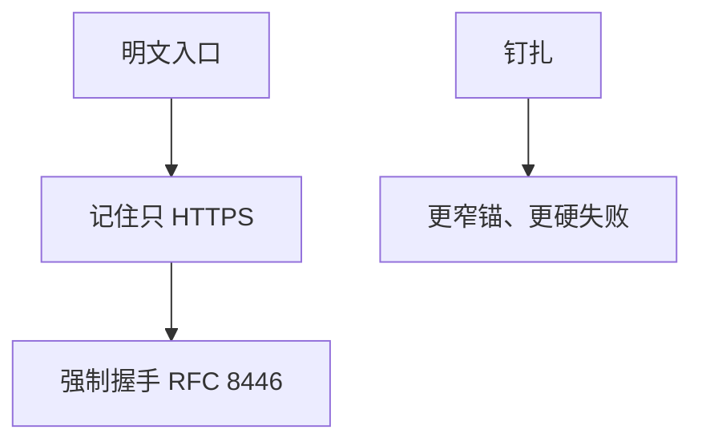

# HSTS 与钉扎对照

HSTS 让浏览器记住「该主机只走 HTTPS」，减少第一次明文被劫持成假站点的窗口；钉扎则把信任锚收得更窄，失败模式也更硬。

<footer>—— 据 RFC 6797 HSTS；Anderson 对钉扎与 PKI 的整理；对照 RFC 8446</footer>

[上一课](/cs/mitm)说明未认证的加密等于与中间人建了两条会话。本课不重做假冒几何。缺口是浏览器的第一次访问：用户敲 `http://`，或被降级。HSTS 用响应头声明只 HTTPS 及期限。证书钉扎对照：只接受某公钥。DoS 下一课打的是 A 轴。

## 问题

中间人课留下「证书关掉缺口」。用户与书签仍可能走 80 端口。[TLS 入口](/cs/http-tls-entry) 假定已经在 TLS 上。HSTS：浏览器为该名字存「强制 HTTPS」，连内部链也升级。预加载列表把第一次访问也收进已知集。钉扎：额外约束叶子或中间 CA，CA 误签也不收——但钉错则自毁访问。缺口是**客户端政策补 PKI**。

HSTS 不修错误的证书链，只修协议降级与明文入口。钉扎在浏览器里已大幅收缩，对照即可，不把已废弃的 HPKP 细节当现行主干。

## 方法

服务器在 HTTPS 响应里声明 max-age。客户端之后拒绝明文与未认证升级。防御降级：不接受「这次用弱套件」。钉扎若用，必须有备份键与过期，否则运维事故变成全局不可用。本课不写如何伪造证书。

## 机制

HSTS 把用户的第一次明文窗口缩小，服务真实性与保密的入口一致性。它依赖一次真实的 HTTPS 才能种下策略（或预加载）。中间人若在种策略前就在路径上，HSTS 尚未生效——预加载是补丁。后课 DoS 不靠假证书，靠资源耗尽。

## 边界

本课不把全部浏览器 UI 锁图标史写进主干。可用如何被洪水与放大打穿，下一课。

后课默认：站点可要求客户端拒绝明文。CIA 的 A 仍可单独失败。

## 小结

- HSTS 强制后续只走 HTTPS，缩小降级窗口。
- 钉扎更窄更脆，仅作对照。
- DoS 与放大下一课。
- 出处：RFC 6797；Anderson；RFC 8446。
