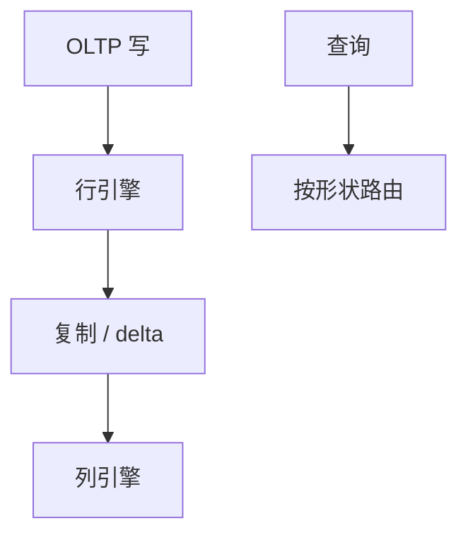

# HTAP

同一份（或可对齐快照的）数据既要短事务又要扫描分析。引擎用双格式、双集群或可更新列存，隔离的是资源与新鲜度合同。

<footer>—— 据 Özcan et al. HTAP 综述；C-Store/HyPer 谱系；OLTP-OLAP 边界</footer>

[上一课](/cs/storage-compute-separation)让计算弹性。本课不挂盘。缺口是工作负载混合：OLTP 要点查与索引，OLAP 要列扫。传统做法 ETL 到数仓，新鲜度小时级。HTAP（Hybrid Transactional/Analytical Processing）要秒级或事务级新鲜。分布式序列接近收口，NewSQL 下一课归产品族。

## 问题

一条缓冲池、一种页格式难同时最优。路径：① 行存主 + 异步列副本（CDC）；② 可更新列存 + delta；③ 内存行 + 列批次（HyPer 热切）；④ 存算分离上两计算引擎读同一 WAL。缺口是**新鲜度、隔离、资源隔离**：分析扫打爆 OLTP 缓冲，2Q 抗扫描不够还要 QoS、WLM。

快照：分析用只读快照不挡 OLTP 写，但 GC 水位或列副本延迟仍在。

HTAP 一词工业界常用。HyPer 热切、TiFlash 列副本质是工程点。本课合同不是商标。

## 方法

声明 SLA：分析可落后 $x$ 秒。路由：短查询走行，扫走列。物化视图在 HTAP 里当列侧预聚合。计划：同一 SQL 两套代价模型。

与 shuffle：列侧 MPP 仍要连接。事务写只打行侧，列侧追。

## 机制

一致性：最强是同一 MVCC 戳两引擎可读；常见是列落后。读己之写：刚写去列侧可能没有，要路由到行或等。TDE 两份。vacuum 与列 compaction 双重 GC。

校准：两套 I/O。计划回归：优化器突然把 OLTP 语句送到列扫。

## 边界

本课不列举 NewSQL 商标列表——下一课分类。也不把 HTAP 当向量数据库。湖仓后课是分析侧文件，新鲜度更松。

后课默认：混合负载要双路径或明确落后。NewSQL：SQL+分布式事务+分片的产品标签。

没有资源隔离的「一个库扛 HTAP」会把 2Q 与 latch 热点一起打穿。

## 小结

- HTAP 用双格式或双引擎对齐新鲜度与资源。
- 分析快照与 OLTP 写的水位要合同。
- NewSQL 下一课。
- 出处：HTAP 综述；HyPer/C-Store；CDC。
