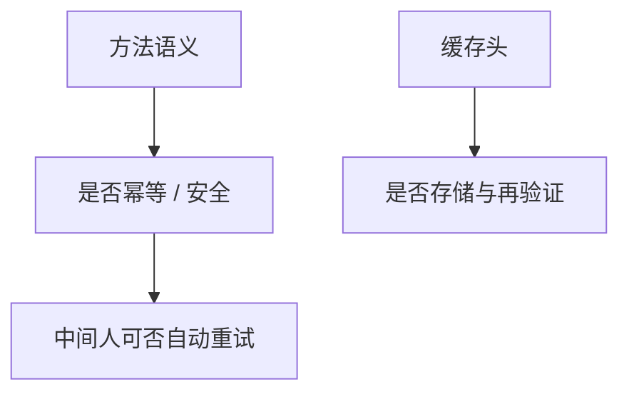

# 方法、幂等与缓存头

方法约定对资源做什么；幂等与安全限制重试能否自动发生。缓存头告诉中间人这份表示能不能存、能存多久。

<footer>—— 据 Fielding 等, RFC 9110, HTTP Semantics, 2022；Kurose and Ross</footer>

[上一课](/cs/http)给出请求–响应：方法、目标、头、状态码。本课不重画一行请求。缺口是语义合同：GET 与 PUT 能否被代理重试、中间盒按什么头缓存。没有这些，后课 HTTP/2 多路只是换了帧，CDN 也不知道什么能复制。

## 问题

[HTTP](/cs/http) 留下方法名。安全方法（GET、HEAD）不应有副作用；幂等方法（含 PUT、DELETE）同一请求重复一次与多次效果相当。POST 通常既不安全也不幂等，丢了不能由中间人盲目重放。`Cache-Control`、`ETag`、条件请求决定表示是否可复用。缺口是**重试与缓存的合法性**，不是 TLS 记录。

RFC 9110 把语义从具体传输版本里抽出来。HTTP/1.1 的连接复用与 HTTP/2 的流共享同一套方法含义。

## 方法

客户端与代理按方法决定：失败的 GET 可重试；失败的 POST 要应用层保证。缓存键通常是方法+目标+相关头；`no-store` 禁止保存，`max-age` 给出新鲜期，验证器用条件 GET 把带宽换成确认。本课不把 Cookie 与会话当缓存替代。

## 机制

幂等把[端到端](/cs/layering-e2e) 重试从传输层（TCP 重传是字节，不是「再做一次业务」）里拆出来：TCP 保证段到达，HTTP 才规定「到达两次」是否事故。缓存把表示从源站路径上拿下来，后课 CDN 只是把缓存放到边上。TLS 入口仍只保护信道，不改方法语义。

## 边界

本课不把 REST 成熟度模型当协议，不引入 GraphQL。一条 TCP 连接上如何避免队头阻塞，下一课 HTTP/2。

后课默认：方法带幂等与缓存合同。多请求并行的传输映射是下一课。

## 小结

- RFC 9110：安全/幂等约束重试；缓存头约束存储。
- 传输重传 ≠ 应用重试。
- 多路复用下一课 HTTP/2。
- 出处：RFC 9110；Kurose and Ross。
