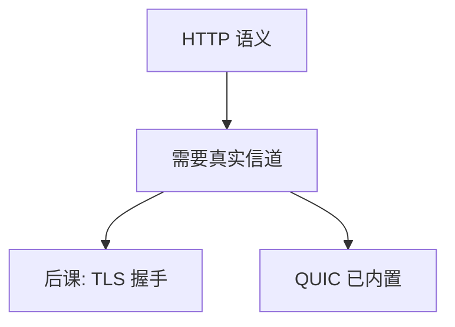

# TLS 入口

HTTP 的方法与正文若在明文 TCP 上走，任何中间盒都能读和改；应用需要一条带真实性的信道。

<footer>—— 据 Rescorla, RFC 8446, The Transport Layer Security Protocol Version 1.3, 2018 的问题设定整理</footer>

[上一课](/cs/http2)把文档语义钉在请求—响应上，默认假设字节不被篡改。互联网路径经过 [BGP](/cs/bgp-intuition) 与 [NAT](/cs/dhcp-nat)，运营者与攻击者都可以做中间人。缺口不是再发明一种方法动词，而是承认：**HTTP 需要带认证（及通常保密）的通道**。完整握手是安全课 [TLS 握手](/cs/tls-handshake)，本课不写密钥交换步骤。

## 问题

DNS 给出的 IP 不证明「对方是证书里的那个名字」。TCP 三次握手只同步序号，任何人都能完成。明文 `GET` 可被注入广告或改登录口。缺口是传输之上（或 QUIC 之内）的一层：对端认证、机密性、完整性，然后才跑 HTTP 语义。HTTPS 只是把 URL 方案换成在 TLS 上的 HTTP，不是新的方法集合。

本课不给证书链验证算法，不画 ClientHello 字段。

真实性：你连上的是你以为的服务器。完整性：字节途中不被改。保密：旁路读不懂。三者可拆，Web 通常一起要。

## 方法

部署直觉：浏览器对 `https` URI 先建立 TCP（或直接 QUIC），再在安全课将学的握手里拿到对称密钥，之后 HTTP 请求作为密文写进去。证书把公钥绑到 DNS 名字——名字来自上一课。失败则整页不加载，而不是「明文凑合」。

## 机制

[端到端论证](/cs/layering-e2e)在这里变成：链路 FCS 与 IP 校验都不认证发送者是谁。认证必须对着名字（或固定公钥），在真正的通信两端做。CDN 下一课会在地理上插入「准端」，证书与名字如何匹配是部署问题，本课只要求「HTTP 不能裸奔」。

与 OS：[套接字](/cs/socket-api) 仍是 `read`/`write`；是否套上 TLS 由库或内核 kTLS 决定，对象不变。

## 边界

本课明确不写握手、不写密码套件谈判、不写 0-RTT 重放。那些是 `/cs/tls-handshake`。也不把证书透明与吊销列表展开。中间盒企业 TLS 拦截是政策与安全课。

HSTS 与升级方案是部署策略，不是本课的握手。混合内容（页面 HTTPS、图片 HTTP）会把真实性缺口从文档缝里漏回去。

证书过期与名字不匹配都应失败关闭，不能回落到明文 HTTP。

后课默认：Web 流量应走有真实性的通道。同一对象从近处缓存取出以降延迟，下一课 CDN 直觉。

## 小结

- 明文 HTTP 无真实性；HTTPS 是 HTTP over 认证加密信道。
- 握手与证书验证留给 [TLS 握手](/cs/tls-handshake)。
- 延迟与缓存是 CDN 的缺口。
- 出处：RFC 8446（问题与位置）；RFC 9110 对 https；Kurose and Ross。
