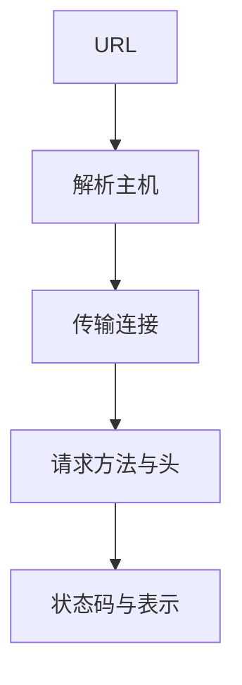

# HTTP

HTTP 是无状态的请求—响应协议：方法、目标、头字段、可选正文；状态码告诉结果。

<footer>—— 据 RFC 2616；Fielding 等, RFC 9110, HTTP Semantics, 2022 整理</footer>

[上一课](/cs/dns-rr)把主机名变成 IP。传输层已能提供字节流或 QUIC 流。缺口是应用层：**HTTP**——对资源做 GET/POST 等，而不是把文档格式写进 TCP。本课用 RFC 9110 的语义，不把 TLS 记录写进来。

## 问题

若每个网站自定「先发文件名再发长度」，浏览器无法通用。[字节流文件](/cs/file-bytestream)在单机；跨机需要方法与媒体类型。HTTP：请求行（方法、目标）、头、正文；响应：状态码、头、正文。无状态：服务器默认不记上一请求，会话用 Cookie 等外挂。缺口是这套语义，不是拥塞算法。

HTTP/1.1 管道与队头、HTTP/2 多路复用点名；HTTP/3 跑在 [QUIC](/cs/quic-contrast) 上。

幂等：GET 不应改资源。缓存与条件请求（`If-Modified-Since`）把[缓冲](/cs/buffer-dirty)的思想拿到应用层，对象是表示而不是磁盘块。

## 方法

客户端解析 URL：方案、主机、路径。DNS → 连接（TCP 80 或后课加密端口）→ 发请求 → 读响应。反向代理与网关仍讲 HTTP 语义。与 VFS 对照：都是「打开对象再读」，但 HTTP 对象是 URL，不是 inode，没有本地目录树的 POSIX 权限模型。

## 机制

HTTP 把互联网的「文档与 API」统一成请求语义，让后课 CDN 可以缓存 GET。端到端：传输保证字节，HTTP 保证「这一表示的含义」；中间缓存必须遵守 Cache-Control，否则语义破。明文 HTTP 任何人可改方法与正文——这正是下一课要引入「需要一条有真实性的通道」的原因。

与进程：每个请求在服务器上最终变成某进程里的 `read`/`write`，经后课套接字。

## 边界

本课不把 REST 成熟度模型当协议标准。不引入 WebSocket 升级的全部状态。Cookie、CSRF 是安全课。明文的问题下一课只点到「为何要 TLS」，不讲握手。

内容协商（`Accept`）让同一 URL 返回不同表示。条件 GET 用验证器减少正文，边缓存与后课 CDN 都靠它。

后课默认：Web 语义是 HTTP。信道若无认证，中间人可改请求；下一课 TLS 入口。

## 小结

- HTTP（RFC 9110 / 2616）是无状态请求—响应，方法加头加正文。
- 依赖 DNS 与传输；不内建加密。
- 真实性通道是下一课入口，完整握手在安全课。
- 出处：RFC 9110；RFC 2616；Fielding, *Architectural Styles…*（REST 论文，作语义背景）。
