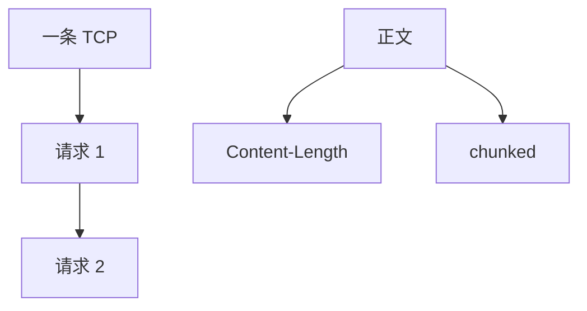

# HTTP/1.1 持久连接与分块

默认保持 TCP 连接复用多个请求；长度未知时用 chunked 编码分块结束，而不再靠关闭连接当 EOF。

<footer>—— 据 RFC 9112 HTTP/1.1；RFC 2616 历史对照整理</footer>

主干[HTTP](/cs/http) 给语义。[上一课](/cs/tcp-wireless) 结束传输进阶。缺口是 **1.1 怎么把消息映到字节流**：Connection: keep-alive 成默认、Content-Length vs chunked。本课不把队头阻塞写完，下一课写。

## 问题

HTTP/1.0 常一请求一连接，握手与慢启动税重。[BDP](/cs/bandwidth-delay-product) 刚填满就拆。1.1：持久连接上串行请求；报文体要么事先长度，要么 `Transfer-Encoding: chunked` 用 0 块结束。管道化（pipelining）允许一次排多个请求，但响应必须顺序——HOL 下一课。分块让动态页面不必先算全长。

不要把持久连接写成 TCP keepalive。

RFC 9112。chunk 大小十六进制。本课不把废弃的 identity 编码展开。

### 不是 TCP keepalive

持久连接摊销握手。chunked 提供无先验长度的成帧。管道化顺序响应，现实常关。

## 方法

画：握手一次 → 多请求 → 长度或分块。对照 TSO：大 write 仍是一请求体。与 MSS 无关直接，但小请求头税相对大。

方法止于选定对象与对照；机制才说它如何嵌入已有分层与主干课。

## 机制

中间代理必须理解分块才能复用连接。TLS 入口在持久连接上摊销握手，动机与 QUIC 1-RTT 同类但层不同。无线掉线后半开，1.1 连接死，应用重开。SYN cookies 只影响新握手次数，持久化减少握手。

安全：未授权的连接复用要把认证绑对（后课 Cookie）。

## 边界

本课不引入 HTTP/1.1 升级头的全部。队头阻塞对照是下一课。后课默认：1.1 默认持久；未知长度用分块。

管道化在现实中常关，因 HOL 与坏代理。

上一课留下的缺口在本课收口；「HTTP/1.1 持久连接与分块」进入后课词汇表后只引用。文献用来钉对象与边界，不把本课写成该主题的独立综述。下一课[队头阻塞对照](/cs/hol-blocking)。

## 小结

- 持久连接摊销握手与慢启动。
- chunked 提供无先验长度的成帧。
- 管道化顺序响应，HOL 留给下一课。
- 后课只引用本课钉死的对象，不从该领域总问题重开。
- 出处：RFC 9112。
