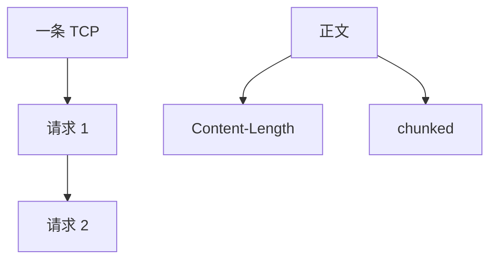
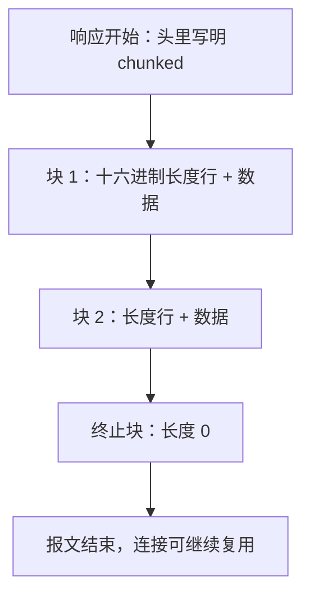

# HTTP/1.1 持久连接与分块

默认保持 TCP 连接复用多个请求；长度未知时用 chunked 编码分块结束，而不再靠关闭连接当 EOF。

<footer>—— 据 RFC 9112 HTTP/1.1；RFC 2616 历史对照整理</footer>

主干[HTTP](/cs/http) 给语义。[上一课](/cs/tcp-wireless) 结束传输进阶。缺口是 **1.1 怎么把消息映到字节流**：Connection: keep-alive 成默认、Content-Length vs chunked。本课不把队头阻塞写完，下一课写。

## 问题

HTTP/1.0 常一请求一连接，握手与慢启动税重。[BDP](/cs/bandwidth-delay-product) 刚填满就拆。1.1：持久连接上串行请求；报文体要么事先长度，要么 `Transfer-Encoding: chunked` 用 0 块结束。管道化（pipelining）允许一次排多个请求，但响应必须顺序——HOL 下一课。分块让动态页面不必先算全长。

术语翻译：成帧（framing）就是在连续的字节流里切出报文边界的手法。TCP 只保证字节按序到达，不告诉你「这条消息到哪结束」——Content-Length 与 chunked 是 HTTP 自己补上的两种切法，一个是「事先说好总长」，一个是「边切边报每段长」。

不要把持久连接写成 TCP keepalive。

RFC 9112。chunk 大小十六进制。本课不把废弃的 identity 编码展开。

### 不是 TCP keepalive

持久连接摊销握手。chunked 提供无先验长度的成帧。管道化顺序响应，现实常关。

## 方法

画：握手一次 → 多请求 → 长度或分块。对照 TSO：大 write 仍是一请求体。与 MSS 无关直接，但小请求头税相对大。

```mermaid
flowchart TD
  TCP["一条 TCP"] --> R1["请求 1"]
  R1 --> R2["请求 2"]
  BODY["正文"] --> CL["Content-Length"]
  BODY --> CH["chunked"]
```

## 机制

中间代理必须理解分块才能复用连接。TLS 入口在持久连接上摊销握手，动机与 QUIC 1-RTT 同类但层不同。无线掉线后半开，1.1 连接死，应用重开。SYN cookies 只影响新握手次数，持久化减少握手。

没有 Content-Length 时，接收方靠什么知道报文在哪结束？

```mermaid
flowchart TD
  S["响应开始：头里写明 chunked"] --> C1["块 1：十六进制长度行 + 数据"]
  C1 --> C2["块 2：长度行 + 数据"]
  C2 --> T["终止块：长度 0"]
  T --> DONE["报文结束，连接可继续复用"]
```

数字实例：发「Hello」用 chunked 上线就是 `5\r\nHello\r\n0\r\n\r\n`——先声明这块有 5 字节，再给数据；长度为 0 的块是「读完了」的暗号。这就是成帧：在一条字节流里切出「这条报文到此为止」的边界。

安全：未授权的连接复用要把认证绑对（后课 Cookie）。

## 边界

本课不引入 HTTP/1.1 升级头的全部。队头阻塞对照是下一课。后课默认：1.1 默认持久；未知长度用分块。

管道化在现实中常关，因 HOL 与坏代理。

下一课[队头阻塞对照](/cs/hol-blocking)。

## 小结

- 持久连接摊销握手与慢启动。
- chunked 提供无先验长度的成帧。
- 管道化顺序响应，HOL 留给下一课。
- 后课只引用本课钉死的对象，不从该领域总问题重开。
- 出处：RFC 9112。

常见误区：把 HTTP 的 `Connection: keep-alive` 与 TCP 的 keepalive 混为一谈。前者是应用层「这条连接别拆，我还要接着发请求」；后者是传输层的空包探测，用来发现死连接。一个省握手，一个查生死，完全两回事。
