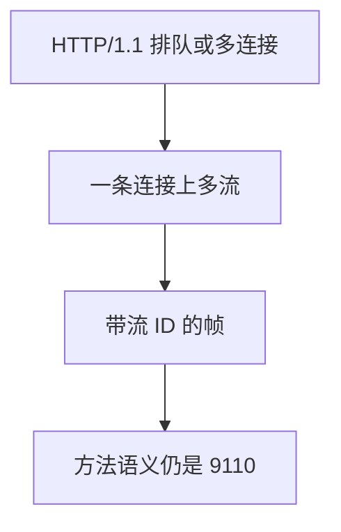

# HTTP/2 多路

在一条加密连接上用流并行许多请求，避免 HTTP/1.1 里「一请求一连接」或队头阻塞在应用层的排队。

<footer>—— 据 RFC 9113, HTTP/2；对照 RFC 9110 语义不变；Kurose and Ross</footer>

[上一课](/cs/http-semantics)钉死方法与缓存头。本课不重写幂等。缺口是映射：HTTP/1.1 在一条连接上请求必须排成队，前一个响应没完，后一个出不去——这是应用层队头阻塞。HTTP/2 把帧编进流，多路复用同一条 TCP（通常再套 TLS）。本课不把 TLS 握手写完。

## 问题

浏览器为躲排队会开许多连接，挤拥塞窗口、加重握手。[Nagle 与延迟 ACK](/cs/nagle-delayed-ack) 在多连接上各自为政。HTTP/2：二进制帧、流标识、优先级直觉、头部压缩。语义仍是 RFC 9110 的请求–响应。缺口是**一条运输连接上的多请求**，不是新方法。

TCP 字节流仍有传输层队头阻塞：丢一个段，所有流停。后课 QUIC 对照把流做到 UDP 上。本课只收到 HTTP/2。

## 方法

握手升级或 ALPN 选 h2。每个请求一个流，帧带流 ID 交错发送。窗口在连接与流两级做流控，避免一个大下载饿死别人。头部压缩减少重复头的字节。服务器推送是可选机制，本课不把它当默认成功故事。

## 机制

多路把「并行」从多条 [TCP 握手](/cs/tcp-handshake) 收成一条连接上的调度，让 [拥塞控制](/cs/tcp-congestion) 看到聚合流量。缓存与幂等不因帧格式改变。中间人若不能解析二进制，就当隧道；可见代理要理解 h2。

## 边界

本课不把 HTTP/3 帧类型插进主干正文，不引入全部 SETTINGS 参数。信道保密与认证下一课 TLS 入口（网络课已排在 HTTP/2 之后）。

后课默认：并行请求可以共享一条 TCP。套上保密管道是 TLS 入口的缺口。

## 小结

- HTTP/2 用流多路，语义仍是 RFC 9110。
- 不消除 TCP 层队头阻塞。
- TLS 入口下一课。
- 出处：RFC 9113；RFC 9110；Kurose and Ross。
