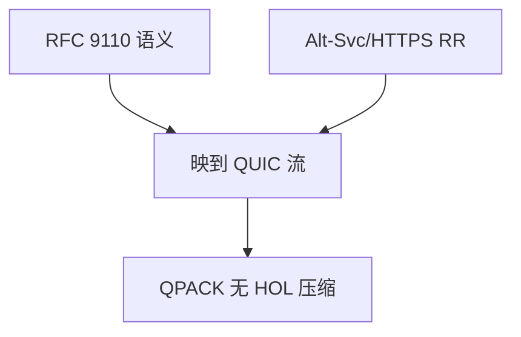

# HTTP/3

把 HTTP 语义映到 QUIC 流：每请求一流，头用 QPACK；运输是 UDP 上的加密多流，不再套 TLS-over-TCP。

<footer>—— 据 RFC 9114 HTTP/3；RFC 9204 QPACK 整理</footer>

[队头对照](/cs/hol-blocking) 指向 QUIC。[QUIC 流](/cs/quic-streams-0rtt) 已备运输。主干语义仍是 [RFC 9110](/cs/http-semantics)。缺口是 **HTTP/3 映射**：SETTINGS、QPACK、Alt-Svc 发现。本课不把 Cookie 写完。

## 问题

HTTP/2 帧不能原样放进 QUIC：流模型与头压缩依赖 TCP 有序。H3：请求体走 QUIC 流，控制流另开，QPACK 用独立流传表更新以免头压缩再引入 HOL。发现：DNS HTTPS RR 或 Alt-Svc 从 H1/H2 升级。0-RTT 可早发 GET，须幂等。

不要把 H3 写成新方法新状态码。

RFC 9114。中间盒对 UDP 443 的态度决定能否用上上一课的迁移。

### 语义不变运输换

QPACK 避免头压缩再 HOL。发现靠 Alt-Svc 或 HTTPS RR。UDP 不通则 H2。CDN 要终止 QUIC。

## 方法

对照：H1 文本 / H2 二进制 TCP / H3 二进制 QUIC。画：浏览器 → QUIC 连接 → 多请求流。与 TSO：UDP GSO。

方法止于选定对象与对照；机制才说它如何嵌入已有分层与主干课。

## 机制

连接迁移让移动 HTTP 会话活过 IP 变。BBR 常为默认 CC。MSS 变成 QUIC 包大小与 PMTUD。Cookie 仍是语义头，下一课。CDN 边缘要终止 QUIC，证书与 CID 路由是运营。

回退：UDP 不通则 H2。不是协议失败，是路径政策。

## 边界

本课不引入 WebTransport 的全部。Cookie 与会话是下一课。后课默认：H3 = HTTP 语义 + QUIC 运输。

公司只开 TCP 443 时用户看不见 H3 好处。

上一课留下的缺口在本课收口；「HTTP/3」进入后课词汇表后只引用。文献用来钉对象与边界，不把本课写成该主题的独立综述。下一课[Cookie 与会话](/cs/cookies-sessions)。

## 小结

- 语义不变，运输换 QUIC。
- QPACK 避免头压缩 HOL。
- 发现与 UDP 路径是部署条件。
- 后课只引用本课钉死的对象，不从该领域总问题重开。
- 出处：RFC 9114；RFC 9204。
