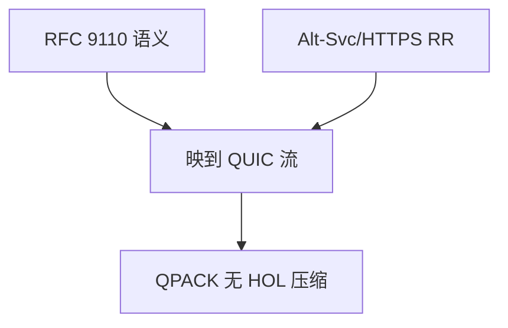
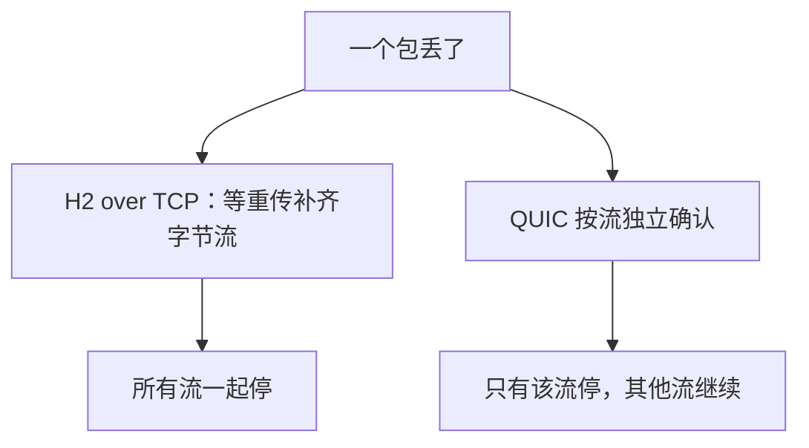

# HTTP/3

把 HTTP 语义映到 QUIC 流：每请求一流，头用 QPACK；运输是 UDP 上的加密多流，不再套 TLS-over-TCP。

<footer>—— 据 RFC 9114 HTTP/3；RFC 9204 QPACK 整理</footer>

[队头对照](/cs/hol-blocking) 指向 QUIC。[QUIC 流](/cs/quic-streams-0rtt) 已备运输。主干语义仍是 [RFC 9110](/cs/http-semantics)。缺口是 **HTTP/3 映射**：SETTINGS、QPACK、Alt-Svc 发现。本课不把 Cookie 写完。

## 问题

HTTP/2 帧不能原样放进 QUIC：流模型与头压缩依赖 TCP 有序。H3：请求体走 QUIC 流，控制流另开，QPACK 用独立流传表更新以免头压缩再引入 HOL。发现：DNS HTTPS RR 或 Alt-Svc 从 H1/H2 升级。0-RTT 可早发 GET，须幂等。

不要把 H3 写成新方法新状态码。

RFC 9114。中间盒对 UDP 443 的态度决定能否用上上一课的迁移。

### 语义不变运输换

HPACK 在 H2 里敢激进更新字典，靠的是 TCP 严格有序；QUIC 流间无序，沿用会重新引入队头阻塞——一次表更新晚到，后续流的解压全卡住。QPACK 把字典更新拆到独立单向流，头块等到所需更新确认送达才消费，压缩不再牵制数据流。发现靠 Alt-Svc 或 DNS HTTPS RR：服务器在既有连接上广告「h3 可用」，下次另起端口另起协议。UDP 不通则回退 H2。CDN 要终止 QUIC——边缘节点必须自己会说 h3，否则收益止步于回源。

## 方法

三代对照：H1 文本、一连接一请求；H2 二进制帧多路复用，但全体共享一条 TCP；H3 二进制，复用建在 QUIC 流上，每请求一流互不阻塞。实现要点在发送侧：TCP 有内核代做的分段，UDP 没有，要靠 UDP GSO 一类接口一次递一大批报文给内核，否则每包一次系统调用的开销吃掉收益。

```mermaid
flowchart TD
  SEM["RFC 9110 语义"] --> H3["映到 QUIC 流"]
  H3 --> QP["QPACK 无 HOL 压缩"]
  DISC["Alt-Svc/HTTPS RR"] --> H3
```

## 机制

连接迁移让移动中的 HTTP 会话活过 IP 变化：连接由 CID 标识而非四元组，Wi-Fi 换蜂窝不断流，这是上一课迁移机制的直接受益者。MSS 语义也换了位置：包大小由 QUIC 自己定并跑 PMTUD；不少部署把 BBR 设为默认 CC。Cookie 仍是语义头，下一课。CDN 边缘终止 QUIC 后，证书管理与按 CID 路由是真实运营工作量。

术语翻译：CID（连接 ID）就是这条连接的「身份证号」，与 IP 地址、端口解耦。TCP 时代换网即断——身份绑在「哪台机哪个口」上；QUIC 把身份换成随机号码，手机从 Wi-Fi 切到 5G 时 IP 变了，号码没变，视频通话与下载都不中断。

回退：UDP 不通则 H2。不是协议失败，是路径政策。

丢一个包，HTTP/2 与 HTTP/3 各冻住多少工作？

```mermaid
flowchart TD
  L["一个包丢了"] --> H2["H2 over TCP：等重传补齐字节流"]
  H2 --> ALL["所有流一起停"]
  L --> H3["QUIC 按流独立确认"]
  H3 --> ONE["只有该流停，其他流继续"]
```

数字实例：一条连接跑 20 个流、丢 1 个包——HTTP/2 下这 20 个流全部卡住等重传（RTT 若 50 ms，就是全体多等 50 ms）；HTTP/3 下只有数据恰好在丢包里的那个流等，其余 19 个照常走。丢包率越高，差距拉得越开，这正是移动网络的常态。

## 边界

本课不引入 WebTransport 的全部。Cookie 与会话是下一课。后课默认：H3 = HTTP 语义 + QUIC 运输。最后一条部署现实：网络只开 TCP 443、UDP 被禁时，用户永远协商不到 H3，QUIC 的好处再大也看不见——协议可用性由路径政策决定。

下一课[Cookie 与会话](/cs/cookies-sessions)。

## 小结

- 语义不变，运输换 QUIC。
- QPACK 避免头压缩 HOL。
- 发现与 UDP 路径是部署条件。
- 后课只引用本课钉死的对象，不从该领域总问题重开。
- 出处：RFC 9114；RFC 9204。

常见误区：初学者容易以为 HTTP/3 发明了新的方法、状态码或缓存规则。GET 还是 GET、404 还是 404——变的只是下层「怎么把字节可靠地送到」：TCP+TLS 换成 UDP 上的 QUIC。语义层不变正是迁移成本低的根本原因。
