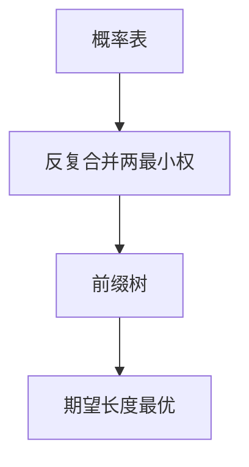

# Huffman 编码

每次合并两个最轻的权，得到的前缀码在整数码长、逐符号意义下期望最短；它逼近熵，但不拆开一个符号内部的比特。

<footer>—— 据 Huffman, A Method for the Construction of Minimum-Redundancy Codes, 1952；Cover and Thomas 整理</footer>

上一课[信源编码定理](/cs/source-coding-theorem) 给出 $H\le L<H+1$ 的空间。缺口是构造：**Huffman 算法**达到所有前缀码中最小的 $L=\sum p_i\ell_i$。不重证 Kraft，不写算术（下一课才把码长变成分数比特）。

## 问题

已知有限字母表与 $p_i>0$。前缀码 $\iff$ 二叉树叶。期望长度 = 加权路径长。Huffman：把最小的两权合成一父节点，权相加，递归。最优性：存在最优码使两最小符号互为兄弟，故归纳成立。码长 $\ell_i=\lceil-\log p_i\rceil$ 的 Shannon 码未必最优，Huffman 才是。

当某 $p_i$ 很大，$L$ 仍 $\ge 1\cdot p_{\max}$，离 $H$ 可差近 1。这是「不拆符号」的代价，留给算术编码。

### 不是「频繁的字母用短 ASCII」

ASCII 定长。Huffman 相对给定 $p$；换语料要换树。自适应 Huffman 点名，本课静态。

Huffman 1952。Cover–Thomas 第 5 章证明最优。Kraft 等号：完全树。本课不把堆实现当主线，算法课已有优先队列。

## 方法

对小分布手算一棵树，核对 $L$ 与 $H$。强调：平局时树不唯一，$L$ 相同。译码：从根走比特。不要用哈夫曼树去纠错——距离无保证。

## 机制

最优前缀码给出可即时译码的比特流，无需逗号。块 Huffman（对 $n$ 元组）把 $L/n$ 推向 $H$，代价是表指数。实践中宁可用自适应或算术。本课把「整数码长最优」钉死。

与[词法 DFA](/cs/regex-lexer) 无关：那是识别，这是编码。

兄弟性质：最稀的两个符号在最优树里深度相同且为兄弟，故贪心合并合法。规范 Huffman 只存码长，译码表更紧，本课不写比特格式。$p_i$ 为 $2$ 的负幂时 $L=H$。否则整数码长是网格，算术下一课拆开格子。

## 边界

本课不证算术，不引入规范 Huffman 的比特级格式。不把 JPEG 的表当定义。后课默认：逐符号前缀最优 = Huffman；分数比特下一课。下一课算术编码。

最优是相对前缀码与给定 $p$ 的期望长度，不是相对算术码，也不是相对 $K(x)$。换语料必须换树或改成自适应。纠错不要用这棵树的码字距离。

上一课留下的缺口在本课收口；「Huffman 编码」进入后课词汇表后只引用。文献用来钉对象与边界，不把本课写成该主题的独立综述。

## 小结

- Huffman 合并最小权，得到最优前缀码。
- $L$ 仍可能比 $H$ 差近 1；块或算术再逼近。
- 相对给定分布；不是字符集。
- 出处：Huffman, 1952；Cover and Thomas。
