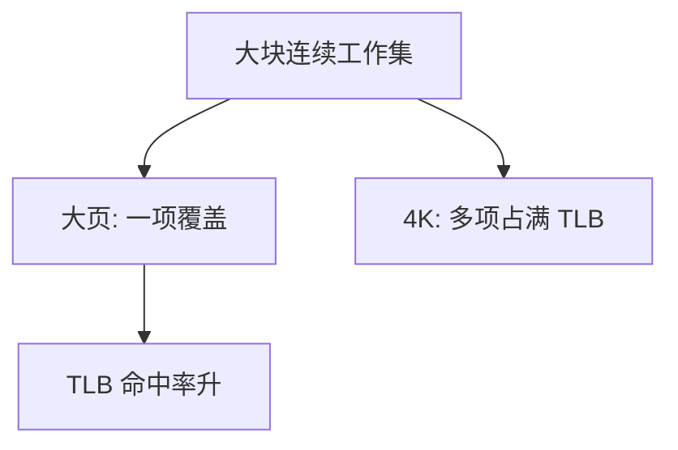

# 大页

用 2MB 或 1GB 的页覆盖同一段虚区间，TLB 里一条就能翻译许多 4K 页曾经占用的项。

<footer>—— 据 Hennessy and Patterson, Computer Architecture: A Quantitative Approach；Navarro 等对超级页的整理</footer>

[上一课](/cs/page-fault-path)按 4K 补页。[TLB](/cs/tlb-translate) 条目有限：工作集一宽，翻译缺失比数据缺失更先爆。[分页](/cs/paging-vm)允许页大小是 2 的幂，硬件用页表中间层的「叶子」指向大块物理内存。缺口是**何时用大页**：减 TLB 压力，而不把按需策略推倒重来。

## 问题

数据库缓冲池、虚拟机客户内存、科学计算数组，往往是连续 GB 级。若全用 4K，TLB 覆盖范围只有「项数 × 4K」。缺口不是新的 MMU 周期公式，而是：内核把若干连续物理页合成更大粒度，页表少走一层，TLB 以大页标签命中。代价是内碎片、分配失败时的回退，以及缺页一次要填的块变大。

本课不把每代 x86 的 PSE/PDPE 控制位写成手册。

透明大页（THP）在运行中折叠或拆开；显式 `mmap`/`hugetlbfs` 由程序申请。折叠需要连续物理内存，与后课 buddy 的高阶块相关。

## 方法

硬件：某级页表项置「大页」位，该项的物理基址对齐到 2MB/1GB，偏移字段变长。[缺页路径](/cs/page-fault-path)若决定用大页，一次分配整块并填一项。用户可 `madvise` 提示；也可映射 hugetlbfs。失败则退回 4K，正确性不变，只是 TLB 覆盖变差。

## 机制

大页把局部性从「页内」扩到「段内」：顺序扫描 2MB 不再换 512 条 4K 翻译。它不改变用户/内核分裂，也不取消按需——可以按大页粒度按需。与 Cache 行无关：大页不是把 Cache 变大，只是翻译变粗。

多核上拆大页或改权限，要冲掉的 TLB 项更「宽」，下一课 shootdown 会更疼。本课只承认粒度变了。

## 边界

本课不保证大页降低每一种负载：指针追逐、稀疏堆可能浪费物理内存。也不把设备 DMA 对齐问题写完。交换大页要拆或整块写出，实现复杂，主干留到 swap 课点名。不要在此重导多级页表。

后课默认：翻译项可以覆盖 2MB 级块。改页表后其他 CPU 的 TLB 如何作废，下一课 TLB shootdown。

## 小结

- 大页用更少 TLB 项覆盖连续工作集。
- 按需仍在，只是分配粒度变大；可回退 4K。
- 多核作废翻译是 shootdown 的缺口。
- 出处：Hennessy and Patterson, *CA:AQA*；Navarro et al., superpages；Tanenbaum *MOS*。
