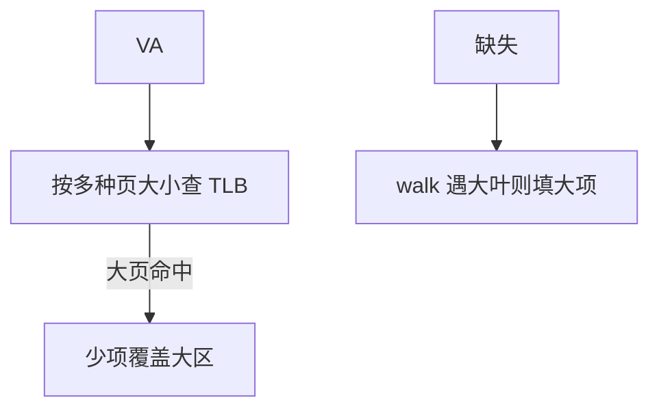

# 大页对 TLB 覆盖

一项 2MiB 映射等于 512 个 4KiB 项；TLB miss 与 PWC 压力一起下降，但内部碎片和预留代价交给 OS。

<footer>—— 据 Navarro et al., Practical, Transparent Operating System Support for Superpages, OSDI 2002；Hennessy and Patterson, CA:AQA 整理</footer>

[上一课](/cs/tlb-hierarchy-pwc) 用更多项和 PWC 扩大翻译覆盖。项数受面积限制。本课不重画四级 walk。缺口是**大页（superpage / hugepage）：增大页大小，让同一 TLB 几何覆盖数兆字节到数吉字节。** 顺带放宽 [VIPT](/cs/vipt-cache) 的索引约束。

## 问题

数据库、JVM、科学数组的工作集远大于 L2 TLB × 4KiB。于是大量时间花在 walk 上，[CPI](/cs/cpi-amdahl) 的翻译项显形。缺口不是再加 4 倍 TLB 项，而是**让一项代表连续对齐的大物理区**。OS 必须找到连续物理内存并维护拆页/合并。

RISC-V Sv39 有 2MiB、1GiB 叶。x86 有 2MiB/1GiB。透明大页（THP）尝试在运行时提升，失败则保持 4KiB。

## 方法

硬件：TLB 项带页大小字段，比较时掩码 VA 低位。同时查找多种大小（分裂阵列或并行 CAM）。缺失 walk 在叶上发现大页则填大项。I/D 与 ASID 规则同小页。

## 机制

覆盖：512× 或 262144× 的数量级变化。VIPT：页内位移变长，L1 可以在不引入 [别名](/cs/cache-aliasing) 的前提下做得更大。代价：写保护、COW、NUMA 迁移要以大页为粒度，细粒度保护变难；内部碎片浪费 DRAM。预取与 [行大小](/cs/line-size-sector) 仍按 cache 行，大页不改变 64B 传输。

混合大小：L1 TLB 常把 4KiB 与 2MiB 分阵列并行查，避免一种大小的 CAM 把另一种挤掉。1GiB 项很少，多在 L2 TLB。拆页（promoted 页被写保护切碎）会瞬间把覆盖吐回去，PMU 上表现为 TLB miss 尖峰。

## 边界

本课不把 Linux `mmap`/`madvise` 写成教程。也不保证大页降低一致性流量——假共享仍按 cache 行。下一课回到多核副本：MESI 不够用时引入 Owned 与转发。

后课默认：翻译覆盖可用大页指数级放大。一致性协议的状态机下一课从 MESI 加 O/F。

## 小结

- 大页用一项覆盖连续大区，TLB/PWC 压力下降。
- OS 负责连续物理页与碎片；硬件负责多大小查找。
- MESI 之上的 Owned/Forward 是下一课。
- 出处：Navarro et al., *OSDI*, 2002；Hennessy and Patterson, *CA:AQA*。
