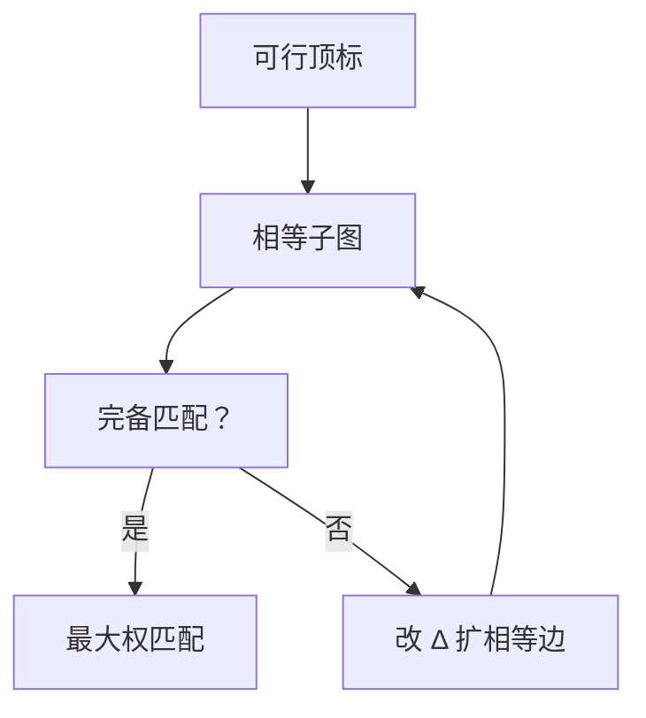

# KM 与最大权匹配

顶标可行时相等子图的完备匹配就是最大权匹配；否则沿交错树改顶标，直到相等子图可完备。

<footer>—— 据 Kuhn, The Hungarian Method for the Assignment Problem, 1955；Munkres, Algorithms for the Assignment Problem, 1957；Kuhn–Munkres / KM 整理</footer>

上一课[Hopcroft–Karp](/cs/hopcroft-karp)给了二分图最大基数。本课加**边权**，求权和最大的匹配（通常 $|L|=|R|$ 的指派）。上一课费用流已能做；本课给组合的顶标算法。不重写 $O(E\sqrt V)$ 的无权重。后课一般图带花。

## 问题

指派：完全二分图，边权 $w(x,y)$。顶标 $lx[x]+ly[y]\ge w(x,y)$ 可行。相等子图：取等号的边。若相等子图有完备匹配，则该匹配权 $\sum w=\sum lx+\sum ly$，而对任何匹配 $\sum w\le\sum lx+\sum ly$，故最优。

若无完备：在相等子图里做匈牙利，得交错树。令 $\Delta$ 为树外松弛量的最小正缺口，树内 $L$ 减 $\Delta$、$R$ 加 $\Delta$，可行性保持，相等边集合变大。直到完备。

缺口是顶标，不是再建费用网络。

### KM 不是「每次贪心最大边」

贪心按权排序加边没有最优保证。顶标是对偶变量，与 LP 对偶同一精神，后课单纯形单元会命名；本课组合叙述。

Kuhn 1955 匈牙利法；Munkres 1957 矩阵形式。KM 常指顶标实现。O(n^3) 是完全图上的常用界。后课 Edmonds 带花处理非二分。

## 方法

初始化 $lx[x]=\max_y w(x,y)$，$ly=0$。循环：相等子图求最大匹配；失败则改顶标。匹配用上一课的增广（实现上常 $O(n)$ 次 DFS 达到 $O(n^3)$）。

不完全二分：补零边。最大权不必基数最大时，用 0 权或费用流更干净。

## 机制

对偶可行保证上界；相等子图完备则原对偶间隙为零。改 $\Delta$ 使至少一条新边进入相等子图，故有限终止。与最小费用流：源汇与费用 $-w$ 的最大流给出同一指派；KM 是组合对偶。

不要把顶标改成随意加减破坏 $lx+ly\ge w$。

## 边界

本课不写一般图最大权（Edmonds 带权更重）。不写拍卖算法。后课默认：二分最大权指派 = KM 或费用流。下一课非二分最大基数：花。

## 小结

- 可行顶标给出权的上界；相等子图完备即最优。
- 无完备则改 $\Delta$ 扩相等边。
- 与费用流等价，本课要组合顶标。
- 出处：Kuhn, 1955；Munkres, 1957。
