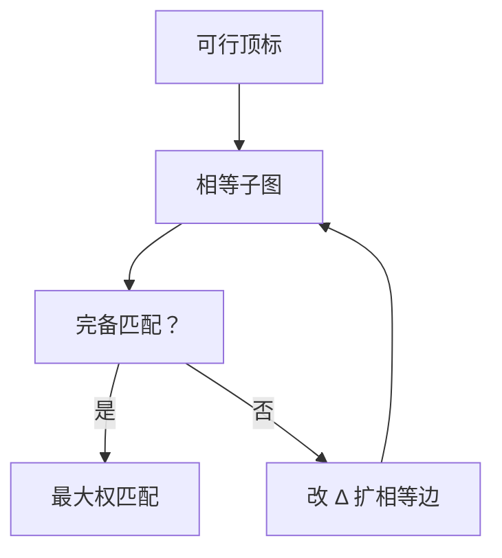
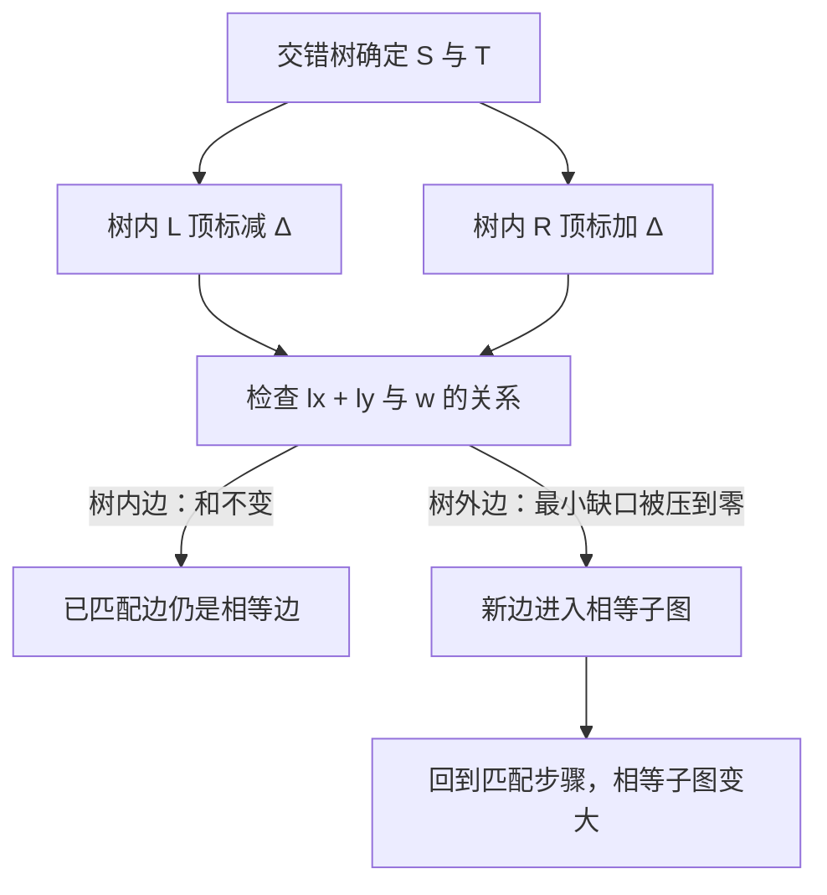

# KM 与最大权匹配

顶标可行时相等子图的完备匹配就是最大权匹配；否则沿交错树改顶标，直到相等子图可完备。

<footer>—— 据 Kuhn, The Hungarian Method for the Assignment Problem, 1955；Munkres, Algorithms for the Assignment Problem, 1957；Kuhn–Munkres / KM 整理</footer>

上一课[Hopcroft–Karp](/cs/hopcroft-karp)给了二分图最大基数。本课加**边权**，求权和最大的匹配（通常 $|L|=|R|$ 的指派）。上一课费用流已能做；本课给组合的顶标算法。不重写 $O(E\sqrt V)$ 的无权重。后课一般图带花。

## 问题

指派：完全二分图，边权 $w(x,y)$。顶标 $lx[x]+ly[y]\ge w(x,y)$ 可行。相等子图：取等号的边。若相等子图有完备匹配，则该匹配权 $\sum w=\sum lx+\sum ly$，而对任何匹配 $\sum w\le\sum lx+\sum ly$，故最优。

顶标可以翻译成「给每个点发一张保底价签」：任何一条边两端的价签之和都不低于这条边的权。算法全程只做一件事——不断调整价签，直到「价签之和恰好等于边权」的边（相等子图）里凑得出一条完备匹配；那一刻价签总和就等于最优匹配权。

若无完备：在相等子图里做匈牙利，得交错树。令 $\Delta$ 为树外松弛量的最小正缺口，树内 $L$ 减 $\Delta$、$R$ 加 $\Delta$，可行性保持，相等边集合变大。直到完备。

缺口是顶标，不是再建费用网络。

### KM 不是「每次贪心最大边」

贪心按权排序加边没有最优保证。顶标是对偶变量，与 LP 对偶同一精神，后课单纯形单元会命名；本课组合叙述。

Kuhn 1955 匈牙利法；Munkres 1957 矩阵形式。KM 常指顶标实现。O(n^3) 是完全图上的常用界。后课 Edmonds 带花处理非二分。

## 方法

初始化 $lx[x]=\max_y w(x,y)$，$ly=0$。循环：相等子图求最大匹配；失败则改顶标。匹配用上一课的增广（实现上常 $O(n)$ 次 DFS 达到 $O(n^3)$）。

代入一个 $2\times 2$ 的小例子：$w=[[5,1],[5,1]]$。初始 $lx=[5,5]$、$ly=[0,0]$，相等子图里两条边都连向 $y_1$，最大匹配只有 1 条，不完备。树外最小缺口 $\Delta=4$：左点顶标降到 1、$y_1$ 升到 4 之后四条边全部进入相等子图，权 6 的完备匹配立刻出现。

```mermaid
flowchart TD
  LAB["可行顶标"] --> EQ["相等子图"]
  EQ --> PM["完备匹配？"]
  PM -->|"是"| OPT["最大权匹配"]
  PM -->|"否"| DEL["改 Δ 扩相等边"]
  DEL --> EQ
```

不完全二分：补零边。最大权不必基数最大时，用 0 权或费用流更干净。

## 机制

对偶可行保证上界；相等子图完备则原对偶间隙为零。改 $\Delta$ 使至少一条新边进入相等子图，故有限终止。与最小费用流：源汇与费用 $-w$ 的最大流给出同一指派；KM 是组合对偶。

```mermaid
flowchart TD
  T["交错树确定 S 与 T"] --> IN["树内 L 顶标减 Δ"]
  T --> OUT["树内 R 顶标加 Δ"]
  IN --> CHK["检查 lx + ly 与 w 的关系"]
  OUT --> CHK
  CHK -->|"树内边：和不变"| KEEP["已匹配边仍是相等边"]
  CHK -->|"树外边：最小缺口被压到零"| NEW["新边进入相等子图"]
  NEW --> LOOP["回到匹配步骤，相等子图变大"]
```

常见误区：以为 $\Delta$ 应该加在「最好的那条边」上。实际上树内 L 减 $\Delta$、树内 R 加 $\Delta$，两个方向正好相抵，所以树内已有边的 $lx+ly$ 不变、不会破坏可行性；被压缩的只有从树内左点指向树外右点的边的缺口——这正是「可行性保持、相等边只增不减」的原因。

不要把顶标改成随意加减破坏 $lx+ly\ge w$。

## 边界

本课不写一般图最大权（Edmonds 带权更重）。不写拍卖算法。后课默认：二分最大权指派 = KM 或费用流。下一课非二分最大基数：花。

## 小结

- 可行顶标给出权的上界；相等子图完备即最优。
- 无完备则改 $\Delta$ 扩相等边。
- 与费用流等价，本课要组合顶标。
- 出处：Kuhn, 1955；Munkres, 1957。
