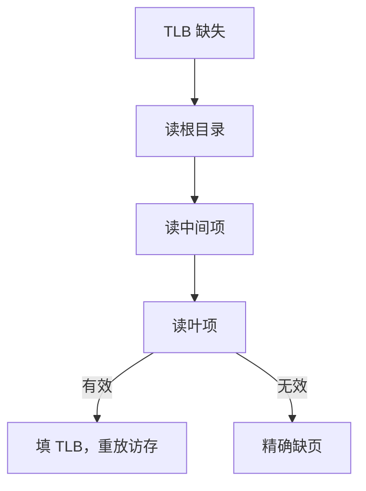

# 硬件页表游走

TLB 缺失不必陷入内核：MMU 按根指针自己走多级表，把叶项填进 TLB，只有真正缺页才陷阱。

<footer>—— 据 Hennessy and Patterson, Computer Architecture: A Quantitative Approach；Patterson and Hennessy, Computer Organization and Design (RISC-V) 整理</footer>

[上一课](/cs/multi-level-page-table)把 VPN 切段、逐级索引，并说硬件或软件都可以走这棵树。[TLB](/cs/tlb-translate) 把缺失写成「查页表填 TLB」，未钉是谁查。本课不重讲三级切分。缺口是硬件页表游走：状态机从 `satp`/`CR3` 一类根寄存器出发，发出若干次普通访存，成功则填 TLB，项无效才精确异常。

## 问题

软件游走：TLB 缺失陷入，内核用特权 load 自己读页表再 `sfence`/`invlpg`。灵活，但路径长，且要处理「走表时再缺页」的嵌套。硬件游走：MMU 在当前特权下发物理（或经允许的虚拟）访问读各级项。缺口不是新的页表格式，而是**把走表从陷阱热路径里拿掉**，让 TLB 缺失更像一次短的 cache 缺失串。

走表访存自己走数据 cache，吃局部性；根和上层目录常热。

x86 长期硬件游走；RISC-V 允许实现选硬件或软件。教学主干取硬件游走，与精确异常衔接更直。

## 方法

TLB 缺失：锁存 VA，从根 PPN 起，按 VPN 段读描述符。有效且指向下一级则继续；叶项有效则把 VPN→PPN 与权限填入 TLB，重放那次 load/store。任一级无效、或权限在当前特权失败：按[流水线异常](/cs/pipeline-exception)报告缺页或保护错，EPC 指向那条访存指令，不指向「假想的走表微指令」。

访问/脏位：硬件可在走表时置 A/D，避免内核事后扫表。本课承认这两位存在，不把原子置位的总线事务写完。

## 机制

CPI 里 TLB 缺失代价 ≈ 级数 × 一次 cache 命中（理想）或 DRAM。与缺页的磁盘代价不在同一量级。硬件游走的访存必须绕过或正确处理「正在翻译的那条」的依赖，否则死锁——实现用独立的走表端口或不可再入的 MMU 缓冲。

多核下，另一核改页表时，硬件游走可能读到撕裂的中间指针；内核仍靠 TLB 射击与页表修改协议。ASID 是下一课，本课假定换进程会处理 TLB。

## 边界

本课不引入反置页表走访、不讨论 nested paging / 二阶段翻译的完整状态机（虚拟机附录）。软件游走作为对照：内核可以做任意保护策略，热路径更慢。也不把走表当成 DMA：那些 load 对软件不可见。

后课默认：TLB 缺失由 MMU 硬件走多级表；只有叶无效才陷入。进程切换时如何避免全刷 TLB，是下一课 ASID/PCID。

## 小结

- 硬件游走让 TLB 缺失不陷入；真缺页才精确异常。
- 走表访存走 cache，代价随级数与是否命中变。
- 用地址空间标签避免切换全刷，是下一课。
- 出处：Hennessy and Patterson, *CA:AQA*；Patterson and Hennessy, *COD* RISC-V 翻译与页表。
