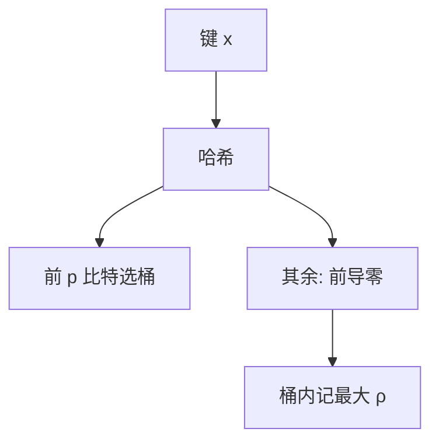

# HyperLogLog

看哈希前导零的最大游程：越长越暗示基数大；多桶平均压方差，空间几千字节估上亿不同键。

<footer>—— 据 Flajolet, Fusy, Gandouet and Meunier, HyperLogLog: The Analysis of a Near-Optimal Cardinality Estimation Algorithm, AOFA 2007；Durand and Flajolet, LogLog, 2003 整理</footer>

[上一课](/cs/count-min-sketch) 估单个键的频次，不直接给「有多少不同键」。精确去重要 $\Theta(n)$ 内存。[通用散列](/cs/universal-hashing) 把键搅匀。本课不取 min 计数。缺口是 HyperLogLog：桶内记 $\rho(h(x))$（前导零+1）的最大，再用调和平均。

## 问题

基数 $n=|\mathrm{set}|$。随机哈希下 $\max\rho$ 约 $\log_2 n$。单桶方差大：拆成 $m=2^p$ 桶，用 $h$ 的前 $p$ 比特选桶，其余算 $\rho$。估计 $\alpha_m m^2 \big/\sum 2^{-M_j}$。缺口是**用极值统计代替存集合**，标准误差约 $1.04/\sqrt{m}$。

Flajolet et al., AOFA 2007。前身 Flajolet–Martin、Durand–Flajolet LogLog。实践 HyperLogLog++ 修小基数偏差，本课点名。

## 方法

`add(x)`：算哈希，更新对应桶 max。`merge`：对桶逐个 $\max$，适合分布式。小 $n$ 时用线性计数修正（空桶）。不要用 HLL 估频次——那是 CM。

与布隆：Bloom 成员；HLL 只基数，不能问某个键在不在。空间 $O(m)$ 字节级寄存器（每桶 5–6 比特可打包）。

## 机制

分析依赖哈希充分随机。对抗哈希可骗前导零，合同与 CM 一样要随机 $h$。合并可交换，符合「多机各吃一分片再合并」。

过滤器下一课回到成员查询：布谷过滤器比 Bloom 更省且可删。

## 边界

本课不把全部偏差校正公式抄完。滑动窗口基数是另一结构。不要把 HLL 当精确 `COUNT(DISTINCT)` 的法律替代——合同是近似。

后课默认：基数用 HLL。可删成员用布谷过滤器。

## 小结

- HLL：桶内最大前导零，调和平均估基数。
- 可合并；空间与误差由桶数定。
- 下一课可删除的近似集。
- 出处：Flajolet et al., 2007；Durand and Flajolet, 2003。
