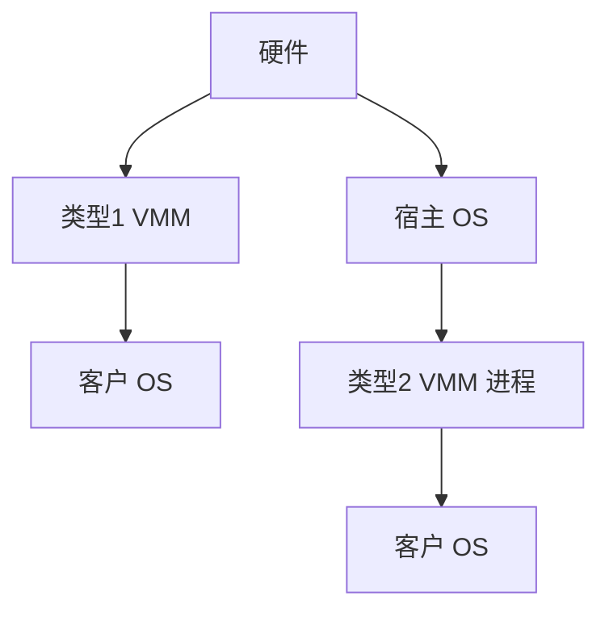

# 虚拟化类型 1 / 2

第一类 hypervisor 直接跑在硬件上调度客户机；第二类作为宿主 OS 的进程，复用宿主驱动与调度，代价是多一层。

<footer>—— 据 Popek and Goldberg 对虚拟机的要求；Tanenbaum 对类型的整理；[内核/用户](/cs/kernel-user) 为特权先修</footer>

[上一课](/cs/kabi-module-signing)收口模块。[KVM](/cs/kvm-qemu) 下一课才拆。缺口是 **类型 1/2**：谁拥有硬件、与容器不是一类。

## 问题

Popek：敏感指令必须陷入。类型 1：Xen、ESXi、Hyper-V bare。类型 2：VirtualBox 在 Linux 上。KVM 常被说成 1.5：Linux 即 hypervisor。缺口：I/O 谁提供（QEMU 用户态）。本课不把产品对比写成采购。

半虚拟化下一课。对象是特权与调度位置，不是云品牌。

## 方法

类型 1：VMM 选客户、处理 VM-exit。类型 2：宿主调度 QEMU 线程，KVM ioctl 进核。对照 [cgroup](/cs/cgroup-cpu-sched)：类型 2 可套 cgroup。对照 [DPDK](/cs/dpdk-kernel-bypass)：旁路是性能，不是 hypervisor 类型。

## 机制

类型决定驱动与延迟路径：类型 1 自己写设备模型或 Dom0；类型 2 借用宿主生态。Popek 条件解释为何需要硬件辅助（下一课 VMX）。不要写成量化多租户。与 [LSM](/cs/lsm-selinux)：宿主 LSM 管类型 2 的 QEMU。

安全边界：类型 2 宿主被攻则客户全完。

实现上：Popek 的敏感指令在 x86 上靠 VMX 补齐历史缺口。类型 2 的设备模型丰富，类型 1 要把驱动放在特权分区或用户 QEMU。KVM 让 Linux 调度器直接管 vCPU 线程。 读法上只引用[上一课](/cs/kabi-module-signing)的结论，不把对象换成训练推理或限价簿。

本课在操作系统进阶的「虚拟化与隔离进阶 / Hypervisor」课序里，对象是 **虚拟化类型 1 / 2**。

- 先修只引用，不重导：上一课的结论当公理，本课只补差。
- 五栏不吞并：不把本课写成大模型训练/推理，也不写成限价簿或权重量化。
- 文献用 OSTEP、McKusick、内核文档与具名会议论文；不发明 arXiv 编号。

## 边界

本课不引入所有 nested 标志。不保证微内核 hypervisor 的归类争论。下一课 KVM 与 QEMU 分工。

版本字段会变，课序钉的是机制对象「虚拟化类型 1 / 2」，不是某一主线内核的结构体名。
后课默认：VMM 可以是裸机或宿主进程。KVM 进核、QEMU 设备模型，下一课。

## 小结

- 类型 1 直接管硬件；类型 2 活在宿主 OS。
- Linux+KVM 是内核作 VMM、用户作设备。
- KVM/QEMU 是下一课。
- 出处：Popek/Goldberg；Tanenbaum *MOS*；KVM 概述。
