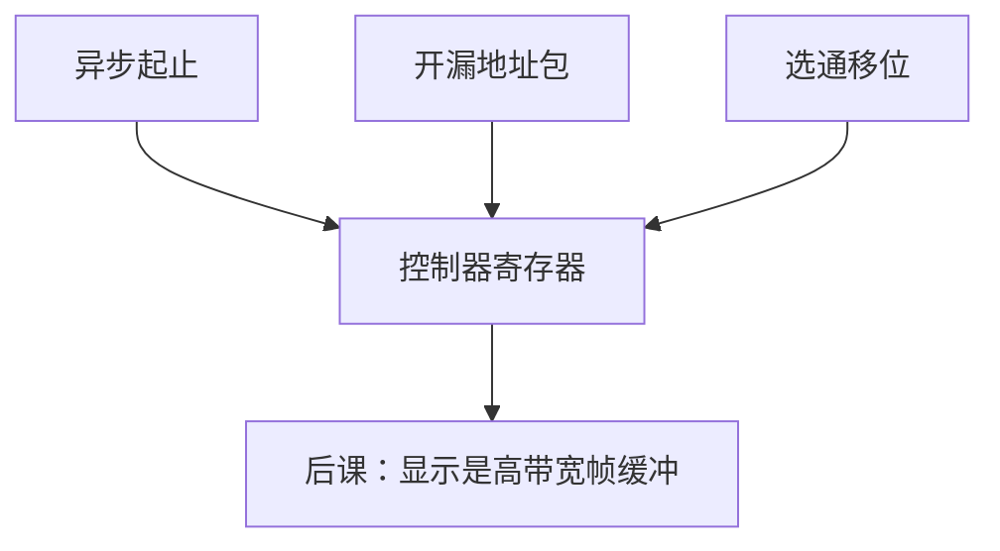

# I²C / SPI / UART

  
片上与板级低速外设用两根线（I²C）、选通时钟（SPI）或异步起止位（UART）：没有 TLP，没有 FTL，只有移位寄存器与时序。

  <footer>—— 据 NXP, I²C-bus Specification；Motorola/Freescale SPI 实践；Harris and Harris, Digital Design and Computer Architecture 整理</footer>

[上一课](/cs/usb-protocol)是主机树与 DMA 环。SoC 上大量传感器、电源管理芯片、启动 ROM 旁的小闪存并不走 USB。缺口是 **I²C、SPI、UART** 这组位移总线，接回 [Verilog](/cs/verilog-basics) 能写的状态机，并对照 PCIe 的重。

## 问题

UART：双方独立时钟，起止位框字节，波特率约定。I²C：SCL/SDA 开漏、地址+ACK、多主仲裁。SPI：SCLK+MOSI+MISO+CS，全双工移位，模式 0–3 定义边沿。缺口不是 USB 描述符，而是这些协议如何被 MMIO 寄存器（或 bit-bang GPIO）驱动，以及为何启动早期用 UART 打日志、用 SPI 读 BIOS 闪存。

速度：通常 Mb/s 级，不是 PCIe GB/s。DMA 可选（UART FIFO、SPI 块），不是必须。

### I²C 不是「慢 PCIe」

无配置空间 BAR 树，无事务层重传（I²C 只有 ACK/NACK）。把 PMIC 当 PCIe 端点枚举会失败。SPI 闪存的命令字节（读 JEDEC ID、页写）是另一套，与 NAND ONFI 不同。

NXP I²C 规范；SPI 是事实标准。Harris 有 UART/SPI 实验。EIA-232 是 UART 的电气历史。本课钉数字时序，不画 RS-232 电平转换器。

## 方法

驱动：写波特率除数、填 FIFO、轮询或中断（可接 [PLIC](/cs/plic-irq)/GIC，通常不是 MSI-X）。I²C 状态机：start、地址、数据、stop；时钟拉伸。SPI：拉低 CS，移 N 拍。与 [CDC](/cs/async-fifo-cdc)：外设时钟域与 CPU 不同时用 FIFO。复位后引脚复用要先配。

固件用 SPI 读引导镜像，下一课帧缓冲则常走内存+扫描 DMA。

## 机制

BIOS/UEFI 课会在 SPI 闪存里取代码，用 UART 报错，用 I²C 读 SPD（DIMM 信息）——把低速总线接到启动。本课先交协议。HDL 实现这些控制器是状态机作业，综合进 ASIC/FPGA。

## 边界

本课不写 CAN/LIN 汽车总线全书，不把 I3C 当 I²C 的必替换。不讨论电磁兼容认证。不进入传感器融合算法。

后课默认：板级低速器用 UART/I²C/SPI；高速块与 GPU 走 PCIe/内存。

## 小结

- UART 异步、I²C 寻址开漏、SPI 选通全双工。
- MMIO 状态机即可，DMA 可选。
- 启动路径常依赖 SPI 闪存与 UART。
- 出处：NXP I²C Spec；SPI 实践；Harris and Harris。
