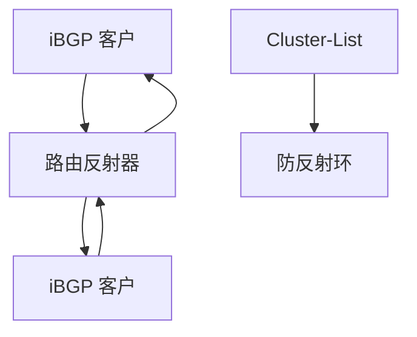

# iBGP 与路由反射器

iBGP 学来的路由默认不再转给其它 iBGP 对等，于是要全网状；路由反射器把网状收成星形，用簇 ID 防环。

<footer>—— 据 RFC 4271 iBGP 再通告规则；RFC 4456 BGP Route Reflection 整理</footer>

[上一课](/cs/bgp-attributes-decision) 选出最佳路径。AS 内部如何把这条路径告诉所有边界路由器？缺口是 **iBGP 全网状问题**与 **RR**：不是再讲 LOCAL_PREF，而是通告范围。本课不把抖动抑制写完。

## 问题

若 iBGP 允许再通告，AS_PATH 不变，环难查。规则：iBGP 学到的不转给 iBGP。于是 $n$ 台边界要 $n(n-1)/2$ 会话。RR：客户把路由发给反射器，反射器按规则转给其它客户与非客户，Cluster-List / Originator-ID 防反射环。联盟（RFC 5065）是另一刀，把 AS 切成子 AS。

不要把 RR 当成 OSPF ABR：IGP 仍要全可达下一跳；RR 只减 BGP 会话。

RFC 4456。下一跳原样保留（除非 next-hop-self）。本课不把 add-path 在 RR 上的部署写完。

### RR 不是 ABR

iBGP 再通告规则逼出全网状或反射。RR 减会话，数据面仍跟 IGP。只反射最佳会藏备选出口。

## 方法

画：全网状 vs RR 星形 vs 两台 RR 冗余。对照 L2：生成树也是减环，但是转发树；RR 是控制面会话树，数据面仍按 IGP 走。

方法止于选定对象与对照；机制才说它如何嵌入已有分层与主干课。

## 机制

决策在每台路由器独立做：RR 若只反射最佳，客户可能看不见备选，热土豆/冷土豆与出口选择会变形——这是 RR 的正确性边界。与 MAC 洪泛不同：这里不洪泛数据包。骨干 IS-IS 提供下一跳可达，BGP 提供前缀。

next-hop-self 常在 RR 或 ASBR 改写下一跳到自己，避免外部下一跳在区内不可达。

## 边界

本课不引入 BGP Confederations 的全部属性改写。BGP 收敛与抖动抑制是下一课。后课默认：iBGP 不全网状就要 RR 或联盟。

单 RR 是控制面单点；成对 RR 要注意簇设计，避免分区时环。

上一课留下的缺口在本课收口；「iBGP 与路由反射器」进入后课词汇表后只引用。文献用来钉对象与边界，不把本课写成该主题的独立综述。下一课[BGP 收敛与抖动抑制](/cs/bgp-convergence-dampening)。

## 小结

- iBGP 不把学来的路由再给 iBGP，故需网状或 RR。
- RR 用簇与 Originator 防环，可能藏备选路径。
- 数据面仍跟 IGP 下一跳。
- 后课只引用本课钉死的对象，不从该领域总问题重开。
- 出处：RFC 4271；RFC 4456。
