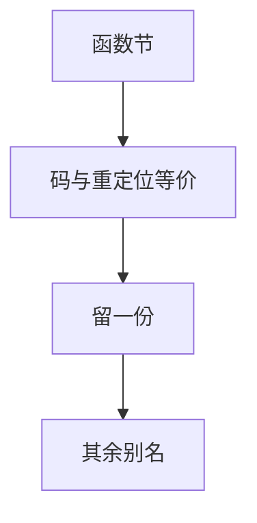

# ICF 同码折叠

若两个函数的机器码与可重定位引用等价，链接器可只留一份，其余改成别名。这是空间优化，不是源级 CSE。

<footer>—— 据 Gold/lld 的 ICF（Identical Code Folding）；Microsoft `/OPT:ICF`；对照[CSE](/cs/cse-gvn) 整理</footer>

上一课[重定位类型](/cs/relocation-types) 决定字节如何填。缺口是**多份相同已生成代码**：模板、单态化、空函数。ICF：比较节内容（含重定位模式），合并。本课钉何时合法（函数指针身份），ELF 格式下一课。

## 问题

C++ 模板对每个 `T` 生成 `swap`，体可能相同。ICF 合并。若程序用函数指针比身份，合并会改变 `f==g`。故：只对 `unnamed_addr` 或语言允许的符号做，或保守不做可观测身份。缺口是**等价 + 身份**，不是 GVN 哈希。

Safe ICF vs 全 ICF：安全模式避免合并地址被取的函数。

### ICF 不是 COMDAT 弱符号

COMDAT 解决「同一模板在多 TU 定义，留一份」。ICF 解决「不同符号碰巧同码」。二者可叠。

MSVC ICF。gold `--icf`。lld。LLVM `unnamed_addr`。本课链接期；编译器也可 merge functions 遍。

## 方法

按节哈希分桶，逐字节+重定位比较。合并后：符号指向同一地址，丢重复节。与 `--gc-sections` 顺序：先垃圾回收再 ICF 或反之，实现相关。

与单态化：膨胀后再 ICF 收回一部分，但不能当不膨胀的理由。

## 机制

调试：多源函数同一地址，DWARF 要能表示。 unwinding：同一 FDE。不要合并后忽略不同的 `.eh_frame` 个性。

相对：字符串折叠（merge rodata）是数据侧同类。

## 边界

本课不写 ELF 头。后课默认：同码可折叠，身份需许可。下一课 ELF 格式：节、段、符号表放哪。

也不把 ICF 当压缩算法课（gzip）。

## 小结

- ICF：链接期合并等价机器码。
- 函数指针身份是合法性边界。
- 与 COMDAT、gc-sections、单态化 complementary。
- 出处：gold/lld ICF；MSVC `/OPT:ICF`；对照 CSE。
