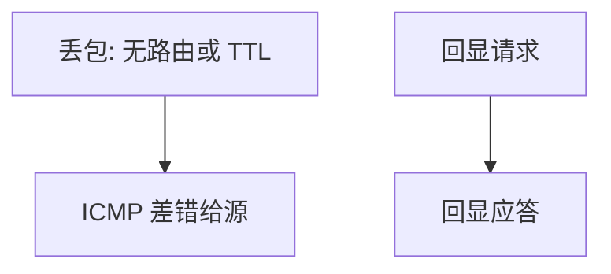

# ICMP

ICMP 承载网络层的差错与诊断：目的不可达、超时、回显；它不是用户字节流。

<footer>—— 据 Postel, RFC 792, Internet Control Message Protocol, 1981 整理</footer>

[上一课](/cs/ip-fragment)可能找不到路由，或 [IP](/cs/ip-subnet) 的 TTL 减到零。静默丢包让源主机无法区分「远」与「死」。缺口是 **ICMP**：对源 IP 回控制报文。本课不把 ping 当应用层协议课程，也不引入 DHCP。

## 问题

路由器丢包若无信号，传输层只能靠超时猜测。RFC 792：目的不可达（网络/主机/端口等）、超时（TTL）、参数问题、源抑制（历史）、重定向、回显请求/应答。ICMP 封装在 IP 里，协议号 1。缺口不是新的 LPM 规则，而是这些消息的语义与限制：差错报文不要再对差错报文生成，以免风暴。

本课不把 ICMP 当隐蔽信道来讲。

Traceroute 利用 TTL=1,2,… 与超时消息探路径，是诊断工具，不是路由协议。路径上的过滤会使结果残缺。

## 方法

转发失败：构造 ICMP，源地址用出接口或路由器地址，目的是原包源地址，载荷含原 IP 头与部分数据以便匹配。主机 ping：回显请求，对端应答。端口不可达常由主机在无监听传输端口时发出，为后课 UDP 预留。

## 机制

ICMP 把网络层的失败接到端系统，但仍是尽力而为：ICMP 自己也会丢。端到端论证：应用不能只靠「没收到 ICMP」断定成功。许多站点过滤 ICMP，于是诊断与「路径 MTU 发现」变钝——PMTU 依赖「需要分片」类消息，本课点名，IPv6 课会强调不分片。

与[信号](/cs/signals)类比：都是异步通知，但 ICMP 走网络，对象是 IP 端点不是 PID。

## 边界

本课不把 ICMPv6 的全部类型列完（邻居发现在 IPv6 课）。不引入 ICMP 重定向作为默认安全实践——可被滥用，主机常忽略。地址如何自动配置、私网如何共享公网地址，下一课 DHCP 与 NAT。

源抑制在当代拥塞控制里已废弃，不应再依赖。重定向把主机的 LPM 改向，错误配置会把流量拐走，许多系统默认忽略。

回显与差错共用协议号，过滤策略要分开看类型。

后课默认：网络层可用 ICMP 报告失败与回显。地址分配与公私网边界，下一课。

## 小结

- ICMP（RFC 792）报告不可达、超时，并提供回显。
- 不为差错再发差错；诊断可被过滤。
- 地址配置与 NAT 是下一课。
- 出处：RFC 792；Kurose and Ross。
