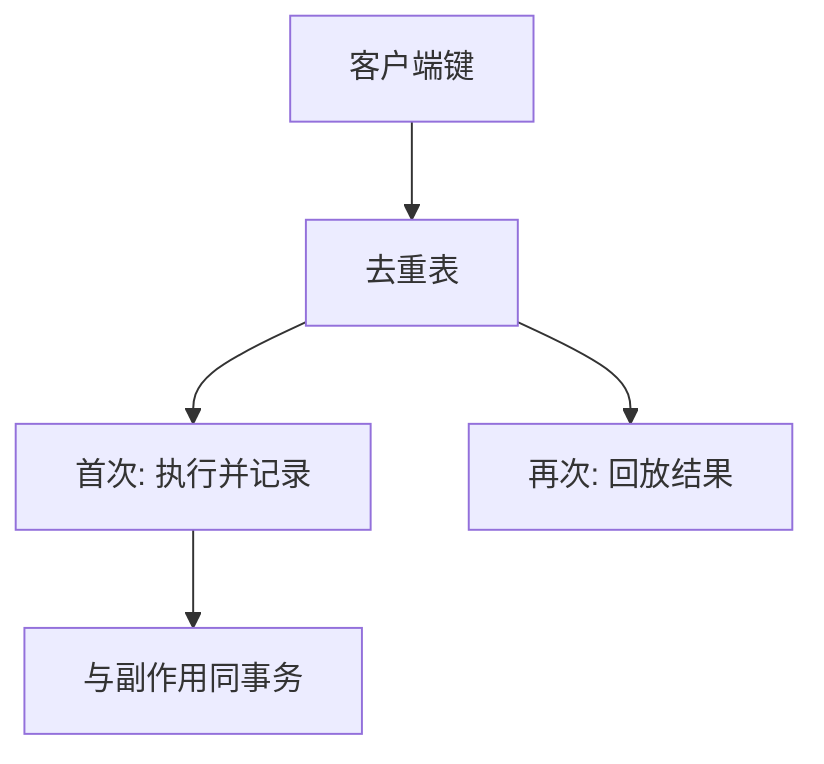

# 幂等键

客户端生成一次请求身份，服务器把副作用与该身份绑在同一持久记录上。重试不再加效果，只返回第一次的结果。

<footer>—— 据 Birrell–Nelson 的调用 ID；Stripe 等支付 API 的 Idempotency-Key 实践；Lamport 对重复请求的讨论整理</footer>

上一课[投递](/cs/delivery-semantics)把重复当成常态。缺口是**应用层去重**：不能指望队列恰好一次。本课钉幂等键的存储与生命周期，不重写 ack 点。后课 Saga 处理「一串步骤」里中间失败，不是单请求重复。

## 问题

键：客户端提供的 UUID 或 `(user, nonce)`。服务器表：`key → 结果或进行中`。相同键第二次来：若已完成则回放结果；若进行中则等待或冲突。缺口：表与副作用必须原子。先做事再记账，崩了会做两遍；先记账再做事，崩了要能恢复成同一结果。

过期：表不能无限。过期后同一键变成新请求——必须让键空间在业务上不重用，或过期长于一切重试窗口。

HTTP 的 `PUT` 幂等是方法性质；`POST` + Idempotency-Key 是协议补丁。二者都要服务器状态。

## 方法

生成：客户端在第一次尝试前生成，重试沿用，不要每次重试 new UUID。作用域：按租户加键，防碰撞。存储：与业务行同库事务，或 RSM 日志一条命令。

只对写。只读天然幂等，不必键——除非读有副作用（计数器）。

## 机制

进行中状态：两个重试并发，要用表上的条件插入当锁，输家等或拿同一结果。否则仍双写。这把[分布式锁](/cs/distributed-lock-fencing)缩小到一行键上，fencing 可以是该行版本。

与 CRDT：幂等键是「同一命令不执行两遍」，CRDT 是「两遍执行结果相同」。计数器 +1 不是幂等，除非 +1 带命令 id。选错代数就会在重试下多加。

本课不把区块链 nonce 当 HTTP 幂等键课。也不写支付合规。

## 边界

本课不设计键的密码学强度全文。不引入 Saga 的补偿键空间。后课默认：至少一次 RPC/消息必须配幂等键或半格操作。Saga 下一课把多步骤的部分执行当对象，单键盖不住跨服务。

键的生命周期 ≥ 重试窗口。短了等于没键。

## 小结

- 幂等键把重复请求映射到同一持久效果。
- 记账与副作用要原子；并发重试要占行。
- 键过期不得短于重试；客户端不得每次换键。
- 出处：Birrell and Nelson 调用 ID；实践中的 Idempotency-Key。
