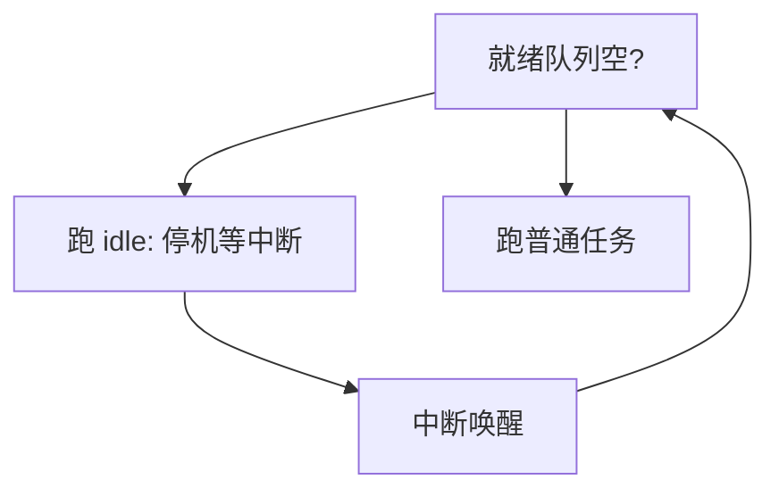

# idle 线程

每颗 CPU 始终要有一条可运行的任务：没有用户工作时，就跑 idle——停机等待中断，而不是在空队列上空转调度器。

<footer>—— 据 Love, Linux Kernel Development；Silberschatz et al. 整理</footer>

[上一课](/cs/fpu-lazy)降低了切换时的寄存器搬运。调度器仍要回答：就绪集合为空时把程序计数器指到哪。若「没有任务」就让 CPU 执行垃圾，机器会飞。[per-CPU 数据](/cs/percpu) 已有核本地状态。缺口是每 CPU 一条 **idle 线程**：永远可运行、优先级最低，体内停机或低功耗等待，被中断叫醒后再进入调度。

## 问题

时钟与设备 IRQ 必须有一个执行上下文来跑上半部；若 CPU 真的「什么都没有」，连中断返回后要恢复的 PCB 都不存在。idle 提供这个底：它是内核线程，无用户地址空间，调度类里排在所有真正工作之后。缺口不是 FPU 策略，而是**空转的合法形态**。

idle 里调用 `wait_for_interrupt` 一类指令，打开中断并停核。唤醒后先跑 ISR，再看是否有新就绪任务；没有则再次停。

## 方法

启动时为每个 CPU 创建 idle `task_struct`，永不退出。主调度循环：选最高优先级就绪任务；若无，选 idle。idle 不累计用户时间。负载统计常把 idle 时间单独记账，以免把「核在睡觉」当成「核在跑公平份额」。

禁止在 idle 里做重活；否则等于偷了一个永远可运行的低优先级工人，延迟难以解释。

## 机制

idle 让「CPU 利用率」有定义：非 idle 时间 / 墙钟。与[中断下半部](/cs/interrupt-bottom-half)会合：设备完成把线程唤醒，idle 被抢占。与内核抢占：idle 自己可被立即切走，因为它不持用户锁。功耗：深 C-state 进 idle 再进，退出延迟是实时课的 WCET 来源之一，本课只承认停机有代价。

## 边界

本课不把 cpuidle 治理器的全部策略写成电源管理课。也不把「空循环 busy idle」当现代默认。tickless 内核如何关掉空闲核上的时钟中断，点到即可。

后课默认：CPU 上永远有当前任务，可能是 idle。有多条真工作时如何比较好坏，下一课先定义[调度指标](/cs/scheduling-metrics)。

## 小结

- 每 CPU 一条 idle：队列空则停机等中断。
- 利用率相对 idle 来定义；idle 不做重活。
- 尺子（周转、响应、公平）是下一课。
- 出处：Love, *LKD*；Silberschatz et al., *OSC*。
