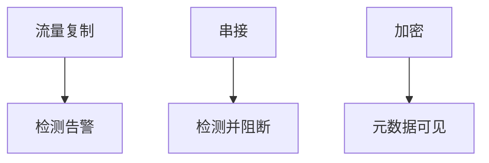

# IDS / IPS

入侵检测看流量或主机事件是否像已知滥用；防护系统还加上阻断。它们识别的是模式与异常，不是应用不变量。漏报与误报同时存在，所以要和日志、响应流程一起设计。

<footer>—— 据 Roesch, Snort；Paxson, Bro；对照 NIST SP 800-94</footer>

## 定位

上一课[BOLA](/cs/api-security-bola)在应用授权。缺口是**网络层可见性**：应用仍会漏，流量侧能否看见扫描、已知利用特征、C2 形态。本课分工 IDS 与 IPS，不写逃避检测的步骤。

后课默认已经读完本课钉下的合同，只补差，不从该领域第一性原理重开。

## 问题

防火墙课管策略放行。[防火墙](/cs/firewall-state)不深检载荷。IDS：旁路告警；IPS：串接阻断。缺口是部署点（网络、主机）与加密流量的盲区。

### 加密后载荷

TLS 后 IDS 只见五元组与 SNI 一类元数据，除非终止 TLS——那是另一威胁模型。

SP 800-94。Snort/Bro 历史。禁止编写逃避 IDS 的教程。下一课规则语言。

## 方法

对照误报成本（可用性）与漏报成本。主机 IDS 看系统调用。下一课 Snort/Suricata 规则形态。

图中节点是本课的机制骨架；课程不把图展开成可运行的攻击步骤。

## 机制

检测服务完整与可用的观测。它不修复 BOLA。规则下一课把「像什么」写成可维护的签名。

前提写进合同之后，游戏外的误用只当失败模式点名，不在本课写成操作程序。

## 边界

不写逃避。下一课规则。

## 小结

- 应用授权之后，流量侧仍要观测。
- IDS 告警，IPS 阻断；加密后见元数据。
- 误报与漏报是合同，不是调参能消掉。
- 下一课 IDS 规则。
- 出处：Roesch, Snort；Paxson, Bro；NIST SP 800-94。
