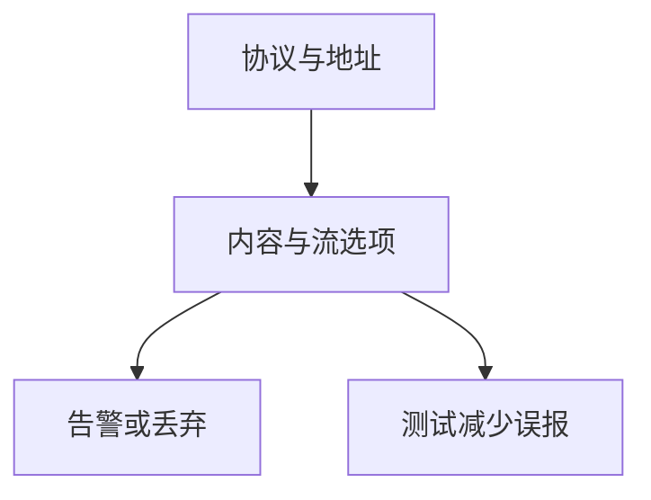

# Snort / Suricata 规则

规则把协议字段、内容匹配与流状态写成可部署的谓词。写得好能抓住已知形态；写得太宽则误杀。规则是知识压缩，不是应用规格。

<footer>—— 据 Snort Users Manual 对规则语言；Suricata 对规则兼容的陈述</footer>

## 定位

上一课[IDS/IPS](/cs/ids-ips)给了盒子。缺口是**规则怎么写才算合同**：协议、端口、内容、流。本课讲形态与维护，不提供针对特定 CVE 的利用匹配教程。

后课默认已经读完本课钉下的合同，只补差，不从该领域第一性原理重开。

## 问题

特征规则对已知利用有效，对加密与变形弱。缺口是：版本管理、测试流量、禁用噪声规则。Emerging Threats 一类社区集要审查后启用。

### 内容匹配的限度

多态与编码让字节特征老化。协议状态比裸字符串稳。

Snort 规则语法公开。课程禁止用规则开发当攻击演练。蜜罐下一课提供另一类观测。

## 方法

读一条规则的头与选项（概念：msg、flow、content）。对照 Suricata 多线程。下一课蜜罐。

图中节点是本课的机制骨架；课程不把图展开成可运行的攻击步骤。

## 机制

签名是过时的知识。要与威胁情报和下下一课 ATT&CK 映射，否则规则集膨胀。蜜罐提供低误报的触点。

前提写进合同之后，游戏外的误用只当失败模式点名，不在本课写成操作程序。

## 边界

不写针对生产的攻击规则。蜜罐下一课。

## 小结

- IDS 要规则才认识形态。
- 协议状态优于裸字符串；要测试误报。
- 加密与变形让特征老化。
- 下一课蜜罐。
- 出处：Snort Users Manual；Suricata 文档。
