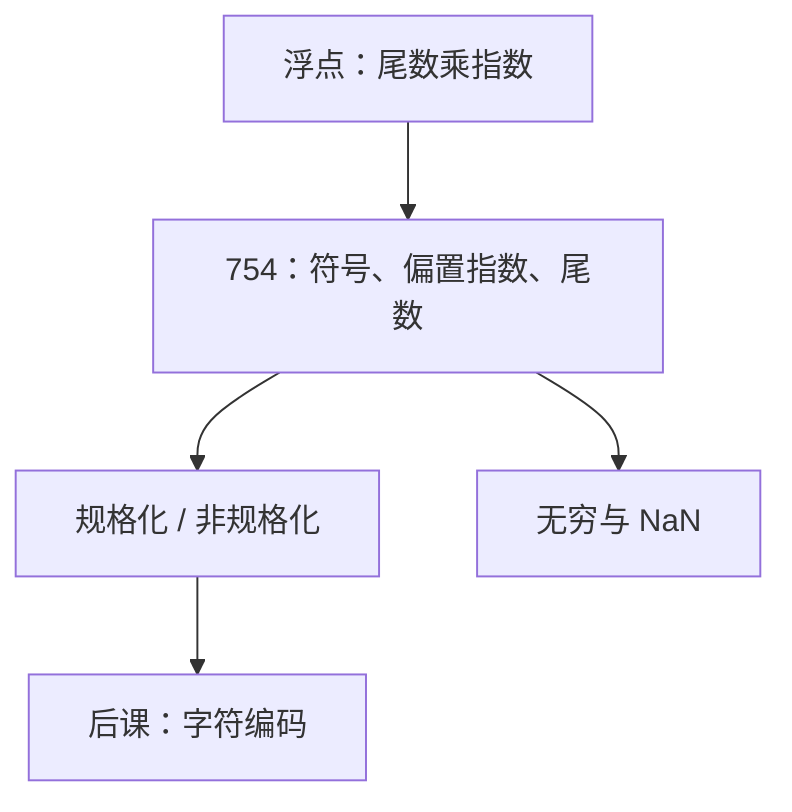

# IEEE 754

若每台机器自己切尾数与指数，同一个算法会算出不同的比特；标准先统一位型，再谈舍入。

<footer>—— 据 IEEE Std 754-1985；IEEE Std 754-2008；Patterson and Hennessy, Computer Organization and Design (RISC-V) 整理</footer>

上一课[定点与浮点](/cs/fixed-and-float)钉死了：非整数要么钉死小数点，要么让指数带着走。本课不重讲对阶，也不从「实数公理」另起。缺口是：浮点还只是形状。没有公共位域，寄存器里的串无法在编译器、ABI 和后课 ISA 之间对齐。

## 问题

$x=\pm m\times 2^e$ 仍有自由度：指数用偏置还是补码、尾数要不要隐藏位、零与溢出怎么编码。1980 年代以前各厂商切法不同，同一段源码换机器结果不同。缺口因此不是再解释「什么是浮点」，而是钉一套**可交换的比特布局**。

IEEE 754-1985 给出 `binary32` 与 `binary64`：1 位符号、偏置指数、规格化尾数的隐藏 $1$。2008 年把同一骨架写成更宽的交换格式，并澄清 NaN 载荷。本课只钉 32/64 位这张表，不把四则运算的每条舍入证明写完。

### NaN 不是「出错整数」

补码溢出仍是某个整数编码。754 把指数全 1 留出来：尾数全 0 是无穷，非 0 是 NaN。比较与加法对 NaN 的规则与整数旗标不同：NaN 与任何值无序。把 NaN 当成「很大的数」，后课的分支会判错。

偏置指数让规格化数的大小比较可以先比符号再当无符号串比——这是 754 的设计，不是补码负权。非规格化数填满零附近的空隙，代价是有效位数下降。

## 方法

`binary32`：指数 8 位，偏置 $127$；尾数 23 位，规格化时隐含首位 $1$，真尾数 24 位。`binary64`：指数 11 位，偏置 $1023$，尾数 52 位。数值

$$
(-1)^s\cdot 1.f\times 2^{E-\mathrm{bias}},
$$

$E$ 全 0 时改走非规格化：$0.f\times 2^{1-\mathrm{bias}}$。舍入默认 round-to-nearest-even。RISC-V 的 `F`/`D` 扩展按这张表装寄存器；本课不把浮点指令表展开。

## 机制

有了位型，相等先是比特相等，再才是数值相等：$-0$ 与 $+0$ 数值相等、比特不同。后课的哈希、序列化必须先说清比的是哪一种。加减对阶、乘加熔合（2008 的 FMA）改变舍入次数，数值可以与「先乘后加」不同；本课只承认这件事，不推导误差界。

规格化使多数值唯一表示，便于比较与译码。隐藏位省 1 比特精度，译码器必须会把它补回去——这是硬件代价，不是数学。

## 边界

本课不讲十进制 754、不把软浮点实现写成代码，也不把异常旗标（无效、除零、上溢、下溢、不精确）接到后课的陷阱入口。那些要等[异常与中断入口](/cs/exception-interrupt-entry)。字符与文本仍未进场。

后课默认：谈到单精度、双精度，位型是 IEEE 754 二进制格式；NaN 与无穷按指数全 1 读。

## 小结

- IEEE 754 把浮点钉成可交换位型：偏置指数加隐藏位。
- 指数全 0 / 全 1 分别承担非规格化、零、无穷、NaN。
- 比较与哈希必须区分比特相等和数值相等。
- 出处：IEEE 754-1985 与 2008；Patterson and Hennessy, COD (RISC-V)。
