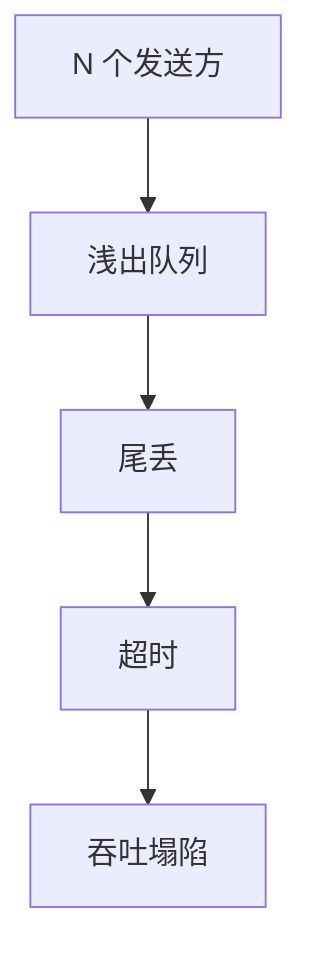

# incast

许多发送方同时打向同一接收方的浅缓冲，瞬时队列溢出；丢的是尾，TCP 超时把好链路当成死。 

<footer>—— 据 Chen, Braud 等数据中心 TCP incast 研究；Alizadeh 等对 DCTCP 动机整理</footer>

[上一课](/cs/datacenter-clos) 的多对一仍汇到叶子出口。[输出排队](/cs/output-queue-hol) 已说热点。缺口是**应用同步扇入**：MapReduce shuffle、存储多块并发读。本课不把 DCTCP 标记写完。

## 问题

RTO 最小在毫秒，数据中心 RTT 在微秒。incast：N 个流的初始窗口同时到达，叶子出端口缓冲只有几十到上百 KB，丢包 → 超时 → 吞吐塌成「好网很慢」。不是 $C$ 不够，是瞬态超订。巨帧让一包占更多缓冲。PFC 可避免丢，但暂停波及 Clos 其它流。

不要把 incast 写成广域拥塞崩溃：时间尺度与扇入结构不同。

文献用 barrier 同步流量复现。本课不给攻击。对策方向：更深缓冲（加重 bufferbloat）、减小 IW、AQM、DCTCP、应用限流。

### 同步扇入打浅缓冲

不是平均 $C$ 不够。短流凑不够 dupACK 只剩 RTO。ECMP 不拆同一出口。加大缓冲会转向膨胀。

## 方法

画：N 发送 → 一出口浅队列 → 丢 → RTO。对照 HOL：结构内部也可丢；incast 强调应用同步。ECMP 帮不上：目的是同一叶子口。

方法止于选定对象与对照；机制才说它如何嵌入已有分层与主干课。

## 机制

Clos 过订购比放大汇聚。RoCE 后课更怕丢，故无损。TCP 快速重传要三个 dupACK，短流可能根本凑不够——只剩超时。这把[RTO](/cs/tcp-rto) 课的下限暴露成数据中心 bug。

应用层：限制并发、请求错开，是端到端对策，符合 Saltzer。

## 边界

本课不引入每种存储协议的扇入参数。DCTCP 是下一课。后课默认：incast = 同步多对一打浅缓冲。

加大缓冲能盖 incast，会把延迟交给后课缓冲膨胀。

上一课留下的缺口在本课收口；「incast」进入后课词汇表后只引用。文献用来钉对象与边界，不把本课写成该主题的独立综述。下一课[DCTCP](/cs/dctcp)。

## 小结

- 同步扇入溢出浅队列，RTO 主导。
- ECMP 不拆同一出口。
- 对策在 AQM/DCTCP/应用限流，不只加带宽。
- 后课只引用本课钉死的对象，不从该领域总问题重开。
- 出处：数据中心 incast 文献；DCTCP 动机。
