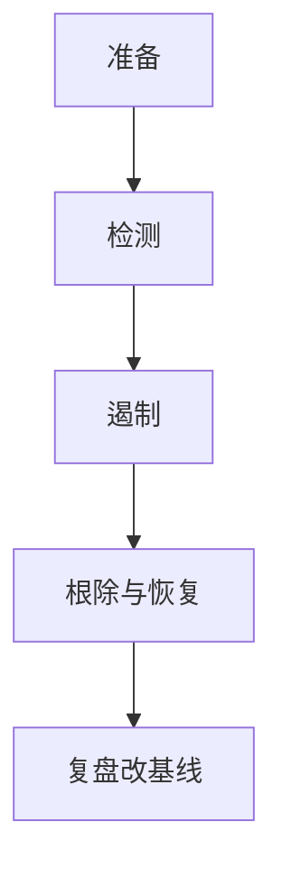

# 事件响应

事件响应是预先写好的状态机：准备、检测、遏制、根除、恢复、复盘。临时发挥会破坏证据并扩大范围。目标是把事故从灾难收成可管理的窗口。

<footer>—— NIST SP 800-61；对照 Anderson 对事故</footer>

## 定位

上一课[SIEM](/cs/siem-logging)告警。缺口是**人与流程接到告警之后**。本课讲生命周期与证据保全，不写攻击者手册。

后课默认已经读完本课钉下的合同，只补差，不从该领域第一性原理重开。

## 问题

告警不等于已定性。先隔离再取证，或先取证再隔离，取决于传播速度。缺口是角色、沟通、法律保留。

### 遏制不等于关机

关机丢易失证据。网卡隔离、凭证轮换常更准。

SP 800-61。禁止报复性黑客。ATT&CK 下一课给对手行为共同语言。

## 方法

六阶段。桌面推演。下一课 ATT&CK 矩阵作检测覆盖图。

图中节点是本课的机制骨架；课程不把图展开成可运行的攻击步骤。

## 机制

响应把纵深从技术接到组织。ATT&CK 下一课把对手技术分类，便于问「我们能看见哪一步」。

前提写进合同之后，游戏外的误用只当失败模式点名，不在本课写成操作程序。

## 边界

不写攻击复现。ATT&CK 下一课。

## 小结

- 日志之后要状态机，不要临时发挥。
- 遏制与取证权衡要预先写。
- 复盘必须改基线，否则只演戏。
- 下一课 ATT&CK。
- 出处：NIST SP 800-61；Anderson。
