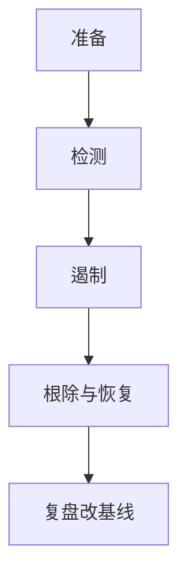

# 事件响应

事件响应是预先写好的状态机：准备、检测、遏制、根除、恢复、复盘。临时发挥会破坏证据并扩大范围。目标是把事故从灾难收成可管理的窗口。

<footer>—— NIST SP 800-61；对照 Anderson 对事故</footer>

上一课[SIEM](/cs/siem-logging)把日志变成告警，告警之后谁接手、按什么次序做，SIEM 不回答。缺口是**人与流程接到告警之后**。本课讲生命周期与证据保全，不写攻击者手册。

后课默认已经读完本课钉下的合同，只补差，不从该领域第一性原理重开。

## 问题

告警不等于已定性：可能是扫描误报，也可能是横向移动的末端，答案只能从证据里来。先隔离再取证，还是先取证再隔离，取决于传播速度：勒索式加密每分钟扩大损失，隔离优先；内存里的密钥一断电就消失，取证优先。权衡不能临场吵，缺口是预先写好的角色分工、沟通渠道与法律保留——哪些证据按呈堂标准链式保管，对外的话由谁说。

### 遏制不等于关机

最直觉的遏制是拔电源，但关机丢掉全部易失证据：内存中的密钥、进程列表、连接表随断电蒸发。更准的是网卡隔离——主机继续运行只是断网，传播停了，证据还在；轮换凭证让攻击者的会话立即失效，常比重装机快。

SP 800-61。禁止报复性黑客：反击违法，还会毁掉自己的证据。ATT&CK 下一课给对手行为共同语言。

## 方法

六阶段各答一问：准备写预案、定角色，临场只剩执行；检测把告警定性成事件；遏制止血；根除移除持久化——攻击者几乎总会留后门，只堵入口等于请他回来；恢复分批回归、加严监控；复盘改基线，把暴露的缺口变成新规则。桌面推演在纸上走一遍，先暴露角色空白与联系方式失效这类便宜就能修的错。下一课 ATT&CK 矩阵作检测覆盖图。

```mermaid
flowchart TD
  PREP["准备"] --> DET["检测"]
  DET --> CON["遏制"]
  CON --> ERAD["根除与恢复"]
  ERAD --> LES["复盘改基线"]
```

## 机制

响应把纵深从技术接到组织：每层控制都会失效，失效后的秩序由本课提供。生命周期是状态机——每阶段有进入条件、输出物和负责人，跳阶段就是漏洞：没定性就遏制，不知道隔离哪几台；没复盘就恢复，同一扇门下周再开。ATT&CK 下一课把对手技术分类，便于问「我们能看见哪一步」。

## 边界

不写攻击复现：对手视角只要求「行为有名字」，条目归下一课 ATT&CK。遏制时限由业务定；复盘文档常按法律特权保管，公开范围先过法务。

## 小结

- 日志之后要状态机，不要临时发挥。
- 遏制与取证权衡要预先写。
- 复盘必须改基线，否则只演戏。
- 下一课 ATT&CK。
- 出处：NIST SP 800-61；Anderson。
