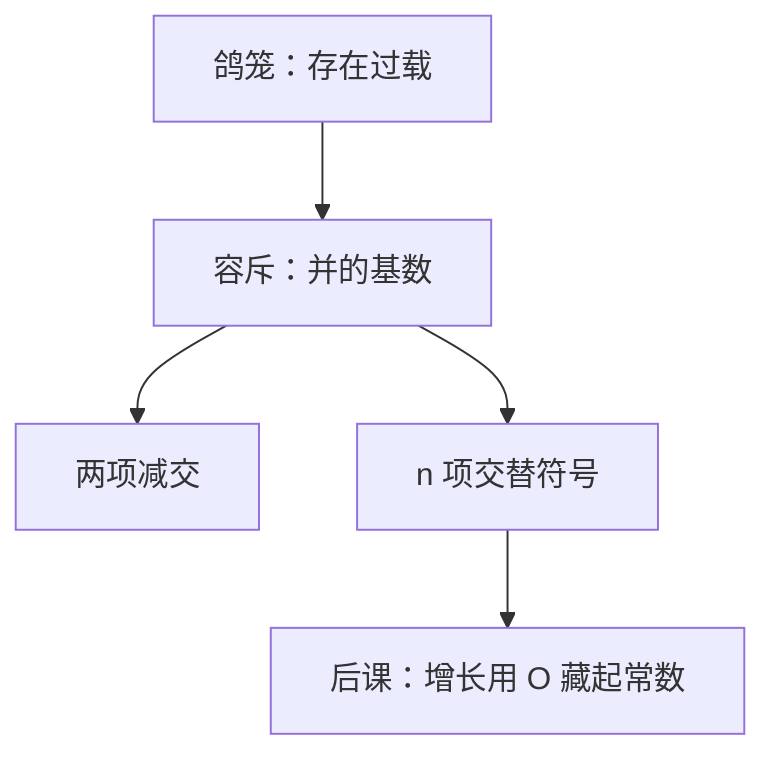

# 容斥

把两堆加起来会把交界数两次；减一次交，三堆则还要按符号把三重交加回来。

<footer>—— 据 Rosen, Discrete Mathematics and Its Applications 整理</footer>

上一课[鸽笼原理](/cs/pigeonhole)钉死了过载笼子里**存在**重复。本课不重证单射否定，也不从生成函数另起。缺口是：存在不够。后课渐近要比较的是函数值，计数有时要 $|A\cup B\cup C|$ 的**精确**公式。交界被加了两次时，鸽笼帮不上忙。

## 问题

$|A\cup B|=|A|+|B|-|A\cap B|$。三项则

$$
|A\cup B\cup C|=|A|+|B|+|C|-|A\cap B|-|A\cap C|-|B\cap C|+|A\cap B\cap C|.
$$

缺口因此不是新的存在原理，而是按包含的奇偶加减：奇数重交加上，偶数重交减去。一般 $n$ 个集合用 $2^n$ 项；本课钉到三项够用，并承认可用归纳把 $n$ 推上去——归纳格式上一课已经有。

错排（无人在原位）是标准应用：全排列减去至少一处固定，再容斥。本课不把 $n!$ 的系统排列课提前，只把「全体减并集」当模式。系统的 $\binom{n}{k}$ 在更后的[组合计数](/cs/counting-combinatorics)。

### 容斥不是概率

写成 $P(\cup A_i)$ 只是两边同除 $|\Omega|$。没有均匀空间时先数元素。把容斥当成贝叶斯，后课条件概率会抢戏。

Rosen 用韦恩图对两项、三项，再用特征函数或归纳写一般式。鸽笼给存在；容斥给并的基数。渐近记号下一课把这些精确计数收成 $O$。

## 方法

两项直接减交。三项按上式。一般：$\lvert\cup_i A_i\rvert=\sum_i|A_i|-\sum_{i\lt j}|A_i\cap A_j|+\cdots+(-1)^{k+1}\sum|A_{i_1}\cap\cdots\cap A_{i_k}|+\cdots$。补集形式：不在任何 $A_i$ 里的个数 $=|\Omega|$ 减并。

## 机制

后课筛法、哈希「至少一类冲突」的计数、电路里「至少覆盖一个最小项」的枚举，都走并集。精确值常含低次项；[下一课](/cs/asymptotic-notation)把它们收进 $O$ 的 $c$。本课先保证 $c$ 来自哪里。

## 边界

本课不把 Möbius 反演写进主干，不引入生成函数。无限并与测度论的容斥不出现。图的边计数用握手更直接，那是图课。

后课默认：重叠的并先容斥；比较算法代价时再把精确式收成 $\Theta$、$O$。

## 小结

- 并集计数按交的重数交替加减。
- 鸽笼管存在，容斥管精确基数。
- 低次项留给下一课渐近记号藏进常数。
- 出处：Rosen, *Discrete Mathematics and Its Applications*。
